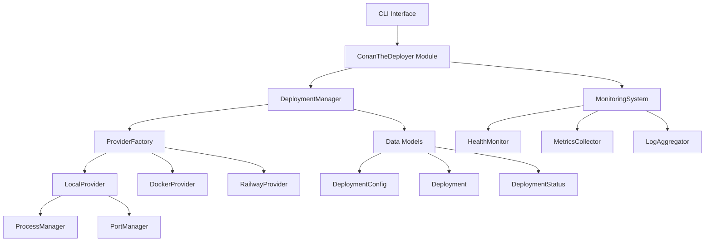

# Conan-the-Deployer: Comprehensive Design Document

## Table of Contents
1. [Overview](#overview)
2. [Architecture](#architecture)
3. [Core Components](#core-components)
4. [Provider System](#provider-system)
5. [Deployment Manager](#deployment-manager)
6. [Monitoring System](#monitoring-system)
7. [API Design](#api-design)
8. [Data Models](#data-models)
9. [Security Considerations](#security-considerations)
10. [Performance and Scalability](#performance-and-scalability)
11. [Testing Strategy](#testing-strategy)
12. [Future Roadmap](#future-roadmap)

## Overview

**Conan-the-Deployer** is a comprehensive deployment and monitoring framework designed as a jsEnvoy module. It provides a unified interface for deploying Node.js applications across multiple platforms (local, Docker, cloud services) with robust monitoring, health checking, and lifecycle management capabilities.

### Key Features
- **Multi-Provider Architecture**: Support for local, Docker, and cloud deployments (Railway, AWS, etc.)
- **Deployment Orchestration**: Queue-based deployment management with retry logic
- **Real-time Monitoring**: Process monitoring, health checks, metrics collection
- **Event-Driven**: EventEmitter-based architecture for real-time updates
- **Test-Driven Development**: Comprehensive test coverage with TDD approach

### Design Principles
- **Modularity**: Clean separation of concerns with pluggable providers
- **Extensibility**: Easy to add new deployment targets and monitoring capabilities
- **Reliability**: Robust error handling, retry mechanisms, and graceful degradation
- **Observability**: Comprehensive logging, metrics, and health checking
- **Developer Experience**: Simple, intuitive API with comprehensive tooling

## Architecture

### High-Level Architecture



### Component Layers

1. **API Layer**: CLI commands and module interface
2. **Orchestration Layer**: DeploymentManager, MonitoringSystem
3. **Provider Layer**: LocalProvider, DockerProvider, RailwayProvider
4. **Utility Layer**: ProcessManager, PortManager, ResourceManager
5. **Data Layer**: Models, configuration, state management

## Core Components

### ConanTheDeployer Module

The main module class that extends jsEnvoy's Module base class and provides the public API.

```javascript
class ConanTheDeployer extends Module {
  constructor() {
    super();
    this.deploymentManager = new DeploymentManager();
    this.monitoringSystem = new MonitoringSystem();
    this.resourceManager = new ResourceManager();
  }
  
  // Tool implementations
  async deployApplication(params) { /* ... */ }
  async monitorDeployment(params) { /* ... */ }
  async updateDeployment(params) { /* ... */ }
  async stopDeployment(params) { /* ... */ }
  async listDeployments(params) { /* ... */ }
  async getDeploymentLogs(params) { /* ... */ }
  async removeDeployment(params) { /* ... */ }
}
```

**Key Responsibilities:**
- Tool method routing and parameter validation
- Integration with jsEnvoy framework
- Event emission for tool execution results
- Resource manager integration for API keys and configuration

### DeploymentManager

Central orchestrator for all deployment operations with queue management and provider coordination.

```javascript
class DeploymentManager extends EventEmitter {
  constructor() {
    super();
    this.providerFactory = new ProviderFactory();
    this.providers = new Map();
    this.deployments = new Map();
    this.deploymentQueue = [];
    this.processingQueue = new Set();
    this.queueStats = { pending: 0, processing: 0, completed: 0, failed: 0 };
    this.providerConcurrencyLimits = new Map();
    this.retryConfig = { /* ... */ };
  }
}
```

**Key Features:**
- **Queue Management**: Sequential processing with concurrency control
- **Provider Selection**: Automatic provider selection based on requirements
- **Retry Logic**: Exponential backoff with configurable retry policies
- **State Tracking**: Comprehensive deployment state management
- **Event System**: Real-time updates via EventEmitter

**Deployment Flow:**
1. Validate deployment configuration
2. Select appropriate provider (manual or automatic)
3. Queue deployment job
4. Process job with retry logic
5. Track deployment state
6. Emit events for status updates

### Provider System

Abstract provider architecture enabling support for multiple deployment targets.

#### BaseProvider

```javascript
class BaseProvider {
  constructor() {
    this.capabilities = this.getCapabilities();
  }
  
  // Abstract methods to be implemented by concrete providers
  async deploy(config) { throw new Error('Not implemented'); }
  async update(deploymentId, config) { throw new Error('Not implemented'); }
  async stop(deploymentId) { throw new Error('Not implemented'); }
  async remove(deploymentId) { throw new Error('Not implemented'); }
  async getStatus(deploymentId) { throw new Error('Not implemented'); }
  async getLogs(deploymentId, options) { throw new Error('Not implemented'); }
  async getMetrics(deploymentId) { throw new Error('Not implemented'); }
  
  // Default implementations
  getCapabilities() { return {}; }
  async checkHealth(deploymentId) { /* ... */ }
}
```

#### LocalProvider

Manages deployments on the local machine using Node.js child processes.

**Components:**
- **ProcessManager**: Spawns and manages Node.js processes
- **PortManager**: Allocates and manages network ports
- **Health Checks**: HTTP-based health monitoring

**Capabilities:**
```javascript
{
  supportsRollingUpdate: true,
  supportsBlueGreen: false,
  supportsHealthChecks: true,
  supportsMetrics: true,
  supportsCustomDomains: false
}
```

**Implementation Highlights:**
- Process lifecycle management with graceful shutdown
- Port allocation with conflict detection
- Log streaming and aggregation
- Resource cleanup and monitoring

#### DockerProvider (Planned)

Will manage containerized deployments using Docker/Podman.

**Planned Capabilities:**
```javascript
{
  supportsRollingUpdate: true,
  supportsBlueGreen: true,
  supportsHealthChecks: true,
  supportsMetrics: true,
  supportsCustomDomains: false
}
```

#### RailwayProvider (Planned)

Will integrate with Railway's GraphQL API for cloud deployments.

**Planned Capabilities:**
```javascript
{
  supportsRollingUpdate: false,
  supportsBlueGreen: false,
  supportsHealthChecks: true,
  supportsMetrics: true,
  supportsCustomDomains: true
}
```

## Deployment Manager

### Queue Management

The DeploymentManager implements a sophisticated queue system for managing concurrent deployments:

```javascript
// Queue structure
{
  id: 'job-1642612345678-abc123',
  operation: 'deploy',
  config: { /* deployment config */ },
  provider: 'local',
  resolve: Function,
  reject: Function,
  retries: 0,
  createdAt: Date
}
```

**Features:**
- **Concurrency Control**: Per-provider limits to prevent resource exhaustion
- **Priority Queuing**: High-priority deployments can jump the queue
- **Retry Mechanism**: Exponential backoff with configurable limits
- **Status Tracking**: Real-time queue statistics

### Provider Selection Logic

```javascript
selectProvider(config) {
  // 1. Explicit provider selection
  if (config.provider) return config.provider;
  
  // 2. Requirement-based selection
  if (config.requirements) {
    for (const providerType of this.availableProviders) {
      const capabilities = this.getProviderCapabilities(providerType);
      if (this.meetsRequirements(capabilities, config.requirements)) {
        return providerType;
      }
    }
  }
  
  // 3. Default to local
  return 'local';
}
```

### Retry Strategy

```javascript
{
  maxRetries: 3,
  initialDelay: 1000,
  maxDelay: 10000,
  backoffFactor: 2
}
```

**Retry Conditions:**
- Network timeouts
- Temporary resource unavailability
- Rate limiting
- Transient provider errors

## Monitoring System

### Health Monitor

Provides comprehensive health checking for deployed applications:

```javascript
class HealthMonitor extends EventEmitter {
  constructor() {
    super();
    this.healthChecks = new Map();
    this.checkInterval = 30000; // 30 seconds
    this.timeout = 5000; // 5 seconds
  }
  
  async checkHealth(deploymentId) {
    // HTTP health checks
    // Process health checks
    // Custom health checks
  }
}
```

**Health Check Types:**
- **HTTP Checks**: GET requests to health endpoints
- **Process Checks**: Process status and responsiveness
- **Custom Checks**: Provider-specific health validation
- **Dependency Checks**: External service availability

### Metrics Collector

Collects and aggregates system and application metrics:

```javascript
class MetricsCollector extends EventEmitter {
  constructor() {
    super();
    this.metrics = new Map();
    this.collectors = new Map();
  }
  
  async collectMetrics(deploymentId) {
    return {
      timestamp: new Date(),
      cpu: { usage: 45.2 },
      memory: { usage: 512000000, limit: 1073741824 },
      network: { rx: 1048576, tx: 2097152 },
      requests: { total: 1234, errors: 5 },
      custom: { /* provider-specific metrics */ }
    };
  }
}
```

**Metric Categories:**
- **System Metrics**: CPU, memory, disk, network
- **Application Metrics**: Request rates, response times, errors
- **Business Metrics**: Custom application-specific metrics
- **Provider Metrics**: Platform-specific metrics

### Log Aggregator

Centralizes log collection and management:

```javascript
class LogAggregator extends EventEmitter {
  constructor() {
    super();
    this.logStreams = new Map();
    this.logBuffer = new Map();
    this.maxBufferSize = 1024 * 1024; // 1MB
  }
  
  async getLogs(deploymentId, options = {}) {
    return {
      deploymentId,
      logs: [
        {
          timestamp: new Date(),
          level: 'info',
          message: 'Server started on port 3000',
          source: 'stdout'
        }
      ],
      hasMore: false
    };
  }
}
```

## API Design

### Tool Definitions

```json
{
  "tools": [
    {
      "name": "deploy_application",
      "description": "Deploy a Node.js application to specified provider",
      "inputSchema": {
        "type": "object",
        "properties": {
          "name": { "type": "string" },
          "projectPath": { "type": "string" },
          "provider": { "type": "string", "enum": ["local", "docker", "railway"] },
          "env": { "type": "object" },
          "port": { "type": "number" },
          "healthCheckPath": { "type": "string" }
        },
        "required": ["name", "projectPath"]
      }
    },
    {
      "name": "monitor_deployment",
      "description": "Monitor deployment health and metrics",
      "inputSchema": {
        "type": "object",
        "properties": {
          "deploymentId": { "type": "string" },
          "metrics": { "type": "array", "items": { "type": "string" } },
          "interval": { "type": "number" }
        },
        "required": ["deploymentId"]
      }
    }
  ]
}
```

### Response Formats

#### Deployment Response
```javascript
{
  success: true,
  deployment: {
    id: 'local-1642612345678',
    name: 'my-app',
    provider: 'local',
    status: 'running',
    url: 'http://localhost:3000',
    startTime: '2024-01-19T10:30:00.000Z',
    pid: 12345,
    port: 3000
  },
  message: 'Application deployed successfully'
}
```

#### Monitoring Response
```javascript
{
  success: true,
  monitoring: {
    deploymentId: 'local-1642612345678',
    status: 'active',
    metrics: {
      cpu: { usage: 45.2 },
      memory: { usage: 512000000, limit: 1073741824 },
      health: { status: 'healthy', lastCheck: '2024-01-19T10:35:00.000Z' }
    },
    interval: 30000
  }
}
```

## Data Models

### DeploymentConfig

```javascript
const deploymentConfigSchema = z.object({
  name: z.string().min(1),
  projectPath: z.string(),
  provider: z.enum(['local', 'docker', 'railway']).optional(),
  env: z.record(z.string()).optional(),
  port: z.number().int().min(1).max(65535).optional(),
  startCommand: z.string().optional(),
  healthCheckPath: z.string().optional(),
  requirements: z.object({
    supportsRollingUpdate: z.boolean().optional(),
    supportsBlueGreen: z.boolean().optional(),
    supportsCustomDomains: z.boolean().optional()
  }).optional()
});
```

### Deployment

```javascript
class Deployment {
  constructor(data) {
    this.id = data.id;
    this.name = data.name;
    this.provider = data.provider;
    this.status = data.status;
    this.projectPath = data.projectPath;
    this.url = data.url;
    this.createdAt = data.createdAt;
    this.updatedAt = data.updatedAt;
    this.metadata = data.metadata || {};
  }
  
  updateStatus(newStatus) {
    this.status = newStatus;
    this.updatedAt = new Date();
  }
}
```

### DeploymentStatus

```javascript
const DeploymentStatus = {
  PENDING: 'pending',
  DEPLOYING: 'deploying',
  RUNNING: 'running',
  UPDATING: 'updating',
  STOPPING: 'stopping',
  STOPPED: 'stopped',
  FAILED: 'failed',
  REMOVING: 'removing'
};
```

## Security Considerations

### API Key Management
- Integration with jsEnvoy ResourceManager for secure credential storage
- Environment-based configuration for different deployment targets
- Automatic credential rotation support

### Process Isolation
- Sandboxed execution environments
- Resource limits and quotas
- Network security policies

### Access Control
- Role-based access to deployment operations
- Audit logging for all deployment activities
- Secure communication channels

### Secrets Management
- Environment variable injection without logging
- Integration with external secret stores (Vault, AWS Secrets Manager)
- Encryption at rest and in transit

## Performance and Scalability

### Optimization Strategies

1. **Resource Management**
   - Connection pooling for provider APIs
   - Efficient memory usage with streaming
   - Process recycling for long-running operations

2. **Caching**
   - Provider capability caching
   - Deployment state caching
   - Metrics aggregation caching

3. **Concurrency**
   - Configurable provider-specific limits
   - Queue-based processing with backpressure
   - Async/await throughout the codebase

4. **Monitoring Efficiency**
   - Sampling-based metrics collection
   - Configurable monitoring intervals
   - Lazy loading of expensive operations

### Scalability Limits

- **Local Provider**: Limited by system resources (CPU, memory, ports)
- **Docker Provider**: Limited by Docker daemon capacity
- **Cloud Providers**: Limited by API rate limits and quotas

## Testing Strategy

### Test Pyramid

1. **Unit Tests** (Foundation)
   - Individual class and method testing
   - Mock-based isolation
   - High coverage (>90%) requirement

2. **Integration Tests** (Middle)
   - Provider integration testing
   - End-to-end deployment flows
   - Cross-component interaction testing

3. **System Tests** (Peak)
   - Full deployment scenarios
   - Performance and load testing
   - Error recovery testing

### TDD Implementation

```javascript
// Test-first approach
describe('LocalProvider', () => {
  test('should deploy Node.js application', async () => {
    // Arrange
    const config = { name: 'test-app', projectPath: '/test' };
    
    // Act
    const deployment = await provider.deploy(config);
    
    // Assert
    expect(deployment.status).toBe('running');
    expect(deployment.url).toMatch(/http:\/\/localhost:\d+/);
  });
});
```

### Mock Strategy

- **External Dependencies**: API clients, file system, network
- **Time-Dependent**: Date/time functions, intervals, timeouts
- **System Resources**: Process spawning, port allocation

### Continuous Testing

- Pre-commit hooks for unit tests
- CI/CD pipeline integration
- Automated performance regression testing

## Future Roadmap

### Phase 1: Foundation (Current)
- ✅ Local Provider Implementation
- ✅ Deployment Manager with Queue System
- ✅ Basic Monitoring and Health Checks
- 🔄 Deployment Validation and Lifecycle

### Phase 2: Docker Support
- 📋 Docker Provider Implementation
- 📋 Container Management and Orchestration
- 📋 Image Building and Registry Integration
- 📋 Volume and Network Management

### Phase 3: Cloud Integration
- 📋 Railway Provider Implementation
- 📋 GraphQL API Integration
- 📋 Custom Domain Management
- 📋 Environment Variable Management

### Phase 4: Advanced Features
- 📋 Blue-Green Deployments
- 📋 Canary Deployments
- 📋 Automatic Scaling
- 📋 Advanced Monitoring and Alerting

### Phase 5: Enterprise Features
- 📋 Multi-tenancy Support
- 📋 Advanced Security Features
- 📋 Compliance and Auditing
- 📋 High Availability Setup

### Phase 6: Ecosystem Integration
- 📋 CI/CD Pipeline Integration
- 📋 Third-party Monitoring Tools
- 📋 External Secret Stores
- 📋 Custom Provider Development Kit

## Conclusion

Conan-the-Deployer represents a comprehensive solution for Node.js application deployment and monitoring. Built with modularity, extensibility, and reliability in mind, it provides a solid foundation for managing deployments across multiple platforms while maintaining a simple and intuitive developer experience.

The test-driven development approach ensures robust, well-tested code, while the provider architecture allows for easy extension to new deployment targets. The event-driven design enables real-time monitoring and observability, making it suitable for both development and production environments.

As the project evolves through its planned phases, it will become an even more powerful tool for modern application deployment and management, supporting advanced deployment strategies and enterprise-grade features.