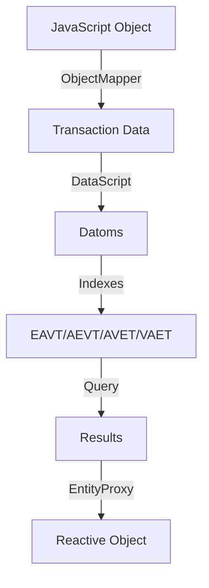

# KM (Knowledge Management) Architecture Guide

## Table of Contents
1. [Overview](#overview)
2. [Architecture Layers](#architecture-layers)
3. [Core Components](#core-components)
4. [Data Flow and Relationships](#data-flow-and-relationships)
5. [Implementation Examples](#implementation-examples)
6. [Design Principles](#design-principles)
7. [Usage Patterns](#usage-patterns)

## Overview

The KM (Knowledge Management) system is a sophisticated, multi-layered architecture for managing knowledge graphs. It combines the power of DataScript (an immutable database engine with Datalog queries) with object-oriented programming paradigms, reactive data patterns, and distributed computing capabilities through an Actor framework.

The system is organized into three main architectural layers, each building upon the previous to provide increasingly high-level abstractions while maintaining performance and flexibility.

## Architecture Layers

### Layer 1: DataScript Core (Foundation)
**Location**: `packages/km/data/datascript/`

This is the foundational layer providing an immutable, in-memory database with Datalog query capabilities.

#### Key Components:
- **Datoms** (`src/core/datom.js`)
  - The atomic unit of data in the system
  - Immutable 5-tuple structure: `{e, a, v, tx, added}`
    - `e` (entity): Numeric entity identifier
    - `a` (attribute): Attribute name (e.g., `:user/name`)
    - `v` (value): The actual value
    - `tx` (transaction): Transaction ID when fact was added
    - `added`: Boolean flag (true = assertion, false = retraction)

- **Database** (`src/core/db.js`)
  - Immutable database value containing all datoms
  - Maintains multiple indexes for efficient querying:
    - EAVT: Entity-Attribute-Value-Transaction
    - AEVT: Attribute-Entity-Value-Transaction
    - AVET: Attribute-Value-Entity-Transaction
    - VAET: Value-Attribute-Entity-Transaction

- **Connection** (`src/core/conn.js`)
  - Manages database state transitions
  - Handles transactions and change notifications
  - Maintains current DB value and transaction history

### Layer 2: Data Store with Proxy Pattern
**Location**: `packages/km/data/data-store/`

This layer adds reactive programming patterns and developer-friendly APIs on top of DataScript.

#### Key Components:
- **EntityProxy** (`src/proxy.js`)
  - NOT JavaScript Proxy objects, but conceptually similar
  - Provides reactive handles to entities in the immutable database
  - Features:
    - **Reactive Property Access**: Always reads from current DB state
    - **Transparent Updates**: Changes forward to DB as transactions
    - **Entity-Rooted Queries**: Use proxy as query context
    - **Lifecycle Management**: Auto-cleanup on entity deletion
    - **Computed Properties**: Cached, auto-updating derived values

- **DataStore** (`src/store.js`)
  - Central coordinator for the proxy system
  - Manages proxy registry to ensure singleton proxies per entity
  - Handles schema definition and validation

- **ReactiveEngine** (`src/reactor.js`)
  - Tracks which queries/subscriptions are affected by changes
  - Efficiently re-executes relevant queries after transactions
  - Batches notifications to prevent cascading updates

- **Subscription System** (`src/subscription.js`)
  - Manages query subscriptions
  - Supports various subscription types:
    - Query subscriptions (re-run on relevant changes)
    - Entity subscriptions (notify on specific entity changes)
    - Computed properties (cached reactive queries)

### Layer 3: Knowledge Graph Integration
**Location**: `packages/km/data/kg-datascript/`

This layer provides high-level knowledge graph operations and distributed computing capabilities.

#### Key Components:
- **KGEngine** (`src/KGEngine.js`)
  - High-level API for knowledge graph operations
  - Combines DataScript core with object mapping
  - Methods:
    - `add(obj, id)`: Add objects to the graph
    - `get(id)`: Retrieve objects by ID
    - `update(obj, updates)`: Update existing objects
    - `find(pattern)`: Pattern-based search
    - `query(datalog)`: Direct Datalog queries

- **ObjectMapper** (`src/ObjectMapper.js`)
  - Bidirectional conversion between JavaScript objects and datoms
  - Handles nested objects and relationships
  - Maintains object identity and references

- **KGEntityHandle** (`src/KGEntityHandle.js`)
  - Client handle for distributed KG operations
  - Communicates via Actor framework messages
  - Supports async operations and subscriptions
  - Enables multi-client scenarios

- **KGDataStoreActor** (`src/server/KGDataStoreActor.js`)
  - Server-side actor managing a KG instance
  - Handles client requests and broadcasts changes
  - Provides WebSocket-based real-time updates

## Data Flow and Relationships

### Object → Datom Transformation



### Example Data Flow

1. **High-Level Operation**:
```javascript
kg.add({ 
  name: "John Doe", 
  age: 30,
  email: "john@example.com" 
})
```

2. **Conversion to Transaction Data**:
```javascript
[
  { ":db/id": -1, 
    ":user/name": "John Doe",
    ":user/age": 30,
    ":user/email": "john@example.com" }
]
```

3. **Resulting Datoms**:
```javascript
[
  { e: 101, a: ":user/name", v: "John Doe", tx: 1001, added: true },
  { e: 101, a: ":user/age", v: 30, tx: 1001, added: true },
  { e: 101, a: ":user/email", v: "john@example.com", tx: 1001, added: true }
]
```

4. **Proxy Access**:
```javascript
const userProxy = store.getProxy(101)
console.log(userProxy.name)  // "John Doe" - pulled from current DB
userProxy.update({ ":user/age": 31 })  // Triggers new transaction
```

### Relationship Management

The system handles relationships through reference attributes:

```javascript
// Schema definition
const schema = {
  ":user/friends": { 
    valueType: "ref",  // Reference to other entities
    card: "many"       // Cardinality: one-to-many
  }
}

// Usage
user1.addRelation(":user/friends", user2)
const friends = user1.friends  // Returns array of EntityProxy objects
```

## Implementation Examples

### Basic Usage

```javascript
// 1. Initialize the system
import { KGEngine } from '@legion/kg-datascript';

const kg = new KGEngine({
  ":user/id": { unique: "identity" },
  ":user/email": { unique: "value" },
  ":user/friends": { valueType: "ref", card: "many" }
});

// 2. Add data
const userId = kg.add({
  name: "Alice",
  email: "alice@example.com",
  age: 28
});

// 3. Query with Datalog
const results = kg.query(`
  [:find ?name ?age
   :where 
   [?e :user/name ?name]
   [?e :user/age ?age]
   [(> ?age 25)]]
`);

// 4. Object-based queries
const users = kg.find({ age: { $gt: 25 } });
```

### Reactive Subscriptions

```javascript
// Create a reactive proxy
const userProxy = store.getProxy(userId);

// Subscribe to changes
const unsubscribe = userProxy.onChange((changes) => {
  console.log('User changed:', changes);
});

// Computed properties
userProxy.computed('friendCount', {
  find: [['(count ?friend)']],
  where: [['?this', ':user/friends', '?friend']]
}, results => results[0][0] || 0);

console.log(userProxy.friendCount); // Auto-updating value
```

### Distributed Usage with Actors

```javascript
// Server side
const actor = new KGDataStoreActor({ 
  schema: mySchema,
  actorSpace: globalActorSpace 
});

// Client side
const handle = new KGEntityHandle({
  actorSpace: globalActorSpace,
  dataStoreId: actor.id
});

// Use handle like local KG
await handle.add({ name: "Bob" });
const bob = await handle.get(bobId);

// Subscribe to changes
await handle.onChange((changes) => {
  console.log('Remote changes:', changes);
});
```

## Design Principles

### 1. **Immutability**
- DataScript database is completely immutable
- Every transaction creates a new database value
- Historical states can be preserved and queried
- Enables time-travel debugging and audit trails

### 2. **Reactivity**
- EntityProxy objects always reflect current database state
- Subscriptions automatically re-execute when relevant data changes
- Computed properties cache results and update on demand
- Change notifications propagate through the system

### 3. **Isomorphism**
- Clean bidirectional mapping between JavaScript objects and graph entities
- Natural object-oriented API while maintaining graph database benefits
- Preserves object identity and relationships

### 4. **Layered Architecture**
- Each layer adds capabilities without breaking lower abstractions
- Can use any layer directly based on needs
- Clean separation of concerns

### 5. **Distribution Ready**
- Actor framework enables multi-client scenarios
- WebSocket support for real-time synchronization
- Handle pattern abstracts local vs. remote operations

### 6. **Performance Optimization**
- Multiple indexes for efficient querying
- Subscription batching to prevent cascades
- Proxy registry ensures singleton instances
- Computed property caching

## Usage Patterns

### Pattern 1: Entity-Centric Operations
Best for: CRUD operations on individual entities

```javascript
const user = kg.get(userId);
user.name = "Updated Name";
user.addFriend(otherUser);
```

### Pattern 2: Query-Centric Operations
Best for: Complex queries across multiple entities

```javascript
const results = kg.query(`
  [:find ?user ?post-count
   :where
   [?user :user/type "author"]
   [?post :post/author ?user]
   [(count ?post) ?post-count]]
`);
```

### Pattern 3: Reactive UI Binding
Best for: Real-time UI updates

```javascript
const userView = store.getProxy(userId);
userView.subscribe(
  { find: ['?name', '?status'], 
    where: [['?this', ':user/name', '?name'],
            ['?this', ':user/status', '?status']] },
  (results) => updateUI(results)
);
```

### Pattern 4: Distributed Collaboration
Best for: Multi-user applications

```javascript
// Each client gets a handle
const handle = new KGEntityHandle({ dataStoreId });

// All changes propagate to all clients
handle.onChange((changes) => {
  syncLocalView(changes);
});
```

## Advanced Features

### Transaction Functions
Custom logic during transactions:

```javascript
kg.transact([
  ['db.fn/call', myCustomFunction, entityId, newValue]
]);
```

### Time Travel
Query historical states:

```javascript
const historicalDB = kg.asOf(timestamp);
const oldValue = historicalDB.get(entityId);
```

### Schema Evolution
Add new attributes dynamically:

```javascript
kg.alterSchema({
  ":user/department": { valueType: "ref" }
});
```

### Performance Monitoring
Track query performance:

```javascript
kg.enableProfiling();
const stats = kg.getQueryStats();
```

## Conclusion

The KM architecture provides a powerful, flexible system for knowledge management that combines the best of graph databases, reactive programming, and distributed systems. Its layered design allows developers to choose the appropriate abstraction level for their needs while maintaining consistency and performance throughout the stack.

The system is particularly well-suited for:
- Applications requiring complex relationship modeling
- Real-time collaborative systems
- Knowledge graphs and semantic web applications
- Systems requiring temporal data and audit trails
- Applications with complex query requirements

By understanding the relationships between datoms, entities, proxies, and KG objects, developers can effectively leverage this architecture to build sophisticated knowledge-driven applications.