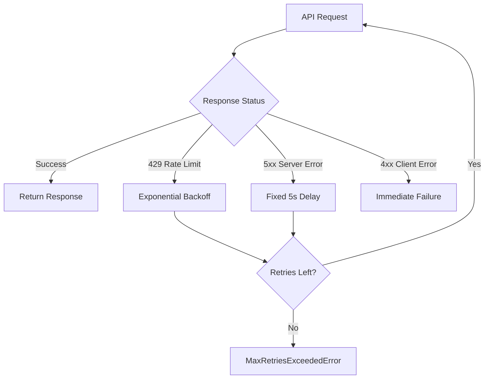

# LLM Client Package Design Document

## Overview

The `@search-demo/llm` package provides a robust, production-ready LLM client specifically designed for knowledge graph construction workflows. It offers intelligent retry logic, comprehensive error handling, and flexible response validation to ensure reliable communication with Large Language Models.

## Table of Contents

1. [Architecture & Design Principles](#architecture--design-principles)
2. [Core Components](#core-components)
3. [Error Handling Strategy](#error-handling-strategy)
4. [Retry Logic & Resilience](#retry-logic--resilience)
5. [Response Validation System](#response-validation-system)
6. [Configuration Options](#configuration-options)
7. [Usage Examples](#usage-examples)
8. [Testing Strategy](#testing-strategy)
9. [Future Extensibility](#future-extensibility)

## Architecture & Design Principles

### Design Philosophy

The LLM client is built around several core principles:

- **Resilience First**: Robust error handling and retry mechanisms for production reliability
- **Validation-Driven**: Built-in response validation to ensure data quality
- **Configuration Flexibility**: Extensive configuration options for different use cases
- **Type Safety**: Full TypeScript support with comprehensive type definitions
- **Single Responsibility**: Focused solely on LLM communication concerns

### Package Structure

```
packages/llm/
├── src/
│   ├── LLMClient.ts     # Core client implementation
│   └── index.ts         # Public API exports
├── __tests__/
│   └── index.test.ts    # Comprehensive test suite
├── docs/
│   └── design.md        # This document
└── package.json         # Package configuration
```

### Dependencies

- **@anthropic-ai/sdk**: Official Anthropic SDK for Claude integration
- **@types/node**: TypeScript definitions for Node.js

## Core Components

### 1. LLMClient Class

The main client class that orchestrates all LLM interactions.

```typescript
class LLMClient {
  constructor(config: LLMClientConfig)
  
  // Core methods
  async complete(prompt: string, maxTokens?: number): Promise<string>
  async completeWithValidation(prompt: string, validator: ResponseValidator, maxTokens?: number): Promise<string>
  async completeWithJsonValidation(prompt: string, maxTokens?: number): Promise<string>
  
  // Configuration accessors
  get currentModel(): string
  get maxRetriesConfigured(): number
}
```

**Key Features:**
- Automatic retry logic with exponential backoff
- Rate limit handling (HTTP 429)
- Server error recovery (HTTP 5xx)
- Response content type validation
- Configurable model selection

### 2. Configuration Interface

```typescript
interface LLMClientConfig {
  apiKey: string;           // Required: Anthropic API key
  model?: string;           // Optional: Model name (default: claude-3-sonnet-20240229)
  maxRetries?: number;      // Optional: Max retry attempts (default: 3)
  baseDelay?: number;       // Optional: Base delay for backoff (default: 1000ms)
}
```

### 3. Response Validation System

```typescript
type ResponseValidator = (response: string) => boolean;
```

The package includes built-in validators:
- **JSON Validator**: Ensures response contains valid JSON
- **Custom Validators**: User-defined validation functions

### 4. Error Classes

#### MaxRetriesExceededError
Thrown when all retry attempts are exhausted.

```typescript
class MaxRetriesExceededError extends Error {
  constructor(message: string)
}
```

#### ValidationError
Thrown when response validation fails after all attempts.

```typescript
class ValidationError extends Error {
  constructor(message: string)
}
```

## Error Handling Strategy

### Error Classification

The client handles three categories of errors:

1. **Rate Limit Errors (HTTP 429)**
   - Automatic retry with exponential backoff
   - Respects rate limiting to avoid API abuse

2. **Server Errors (HTTP 5xx)**
   - Fixed 5-second delay before retry
   - Assumes temporary server issues

3. **Client Errors (HTTP 4xx, except 429)**
   - No retry (permanent errors)
   - Immediate failure with descriptive error

### Error Recovery Flow



## Retry Logic & Resilience

### Exponential Backoff Algorithm

For rate limit errors (429), the client uses exponential backoff:

```typescript
delay = baseDelay * Math.pow(2, attemptNumber)
```

**Example delays with baseDelay=1000ms:**
- Attempt 1: 1000ms (1s)
- Attempt 2: 2000ms (2s)  
- Attempt 3: 4000ms (4s)

### Server Error Handling

For server errors (5xx), a fixed 5-second delay is used to allow server recovery time.

### Retry Configuration

```typescript
const client = new LLMClient({
  apiKey: 'your-api-key',
  maxRetries: 5,        // Increase for high-reliability scenarios
  baseDelay: 500        // Decrease for faster retry cycles
});
```

## Response Validation System

### Built-in JSON Validation

The `completeWithJsonValidation` method ensures responses contain valid JSON:

```typescript
const response = await client.completeWithJsonValidation(
  "Generate a JSON object with user data"
);
// Guaranteed to contain valid JSON
```

### Custom Validation

Create custom validators for specific requirements:

```typescript
const emailValidator: ResponseValidator = (response) => {
  return response.includes('@') && response.includes('.');
};

const response = await client.completeWithValidation(
  "Generate an email address",
  emailValidator
);
```

### Validation Retry Logic

When validation fails:
1. Append failure feedback to prompt
2. Retry with enhanced prompt
3. Continue until validation passes or max retries reached

## Configuration Options

### Model Selection

```typescript
// Use different Claude models
const client = new LLMClient({
  apiKey: 'your-key',
  model: 'claude-3-opus-20240229'    // More capable model
});
```

### Retry Behavior

```typescript
// High-reliability configuration
const reliableClient = new LLMClient({
  apiKey: 'your-key',
  maxRetries: 10,      // More retry attempts
  baseDelay: 2000      // Longer initial delay
});

// Fast-response configuration  
const fastClient = new LLMClient({
  apiKey: 'your-key',
  maxRetries: 1,       // Fail fast
  baseDelay: 100       // Minimal delay
});
```

## Usage Examples

### Basic Usage

```typescript
import { LLMClient } from '@search-demo/llm';

const client = new LLMClient({
  apiKey: process.env.ANTHROPIC_API_KEY!
});

// Simple completion
const response = await client.complete(
  "Explain the concept of knowledge graphs",
  500  // max tokens
);
```

### JSON Response Handling

```typescript
// Ensure JSON response
const jsonResponse = await client.completeWithJsonValidation(`
  Generate a JSON object representing a person with name, age, and email.
  Respond only with valid JSON.
`);

const person = JSON.parse(jsonResponse.match(/\{[\s\S]*\}/)[0]);
```

### Custom Validation

```typescript
// Validate specific format
const codeValidator = (response: string) => {
  return response.includes('function') && response.includes('{');
};

const code = await client.completeWithValidation(
  "Write a JavaScript function to calculate factorial",
  codeValidator
);
```

### Error Handling

```typescript
import { MaxRetriesExceededError, ValidationError } from '@search-demo/llm';

try {
  const response = await client.completeWithJsonValidation(prompt);
  // Process successful response
} catch (error) {
  if (error instanceof MaxRetriesExceededError) {
    console.error('Service temporarily unavailable');
  } else if (error instanceof ValidationError) {
    console.error('Could not get valid response format');
  } else {
    console.error('Unexpected error:', error);
  }
}
```

## Testing Strategy

### Test Coverage Areas

1. **Configuration Validation**
   - Required API key validation
   - Default value application
   - Invalid configuration handling

2. **Retry Logic Testing**
   - Exponential backoff calculation
   - Maximum retry enforcement
   - Different error type handling

3. **Response Validation**
   - JSON validation accuracy
   - Custom validator execution
   - Validation failure handling

4. **Error Scenarios**
   - Rate limit simulation
   - Server error simulation
   - Network failure handling

### Mock Testing Approach

```typescript
// Example test structure
describe('LLMClient', () => {
  it('should retry on rate limit errors', async () => {
    // Mock 429 response followed by success
    // Verify exponential backoff timing
    // Confirm eventual success
  });
  
  it('should validate JSON responses', async () => {
    // Mock invalid JSON response
    // Verify retry with enhanced prompt
    // Confirm validation success
  });
});
```

## Future Extensibility

### Planned Enhancements

1. **Multi-Provider Support**
   - OpenAI GPT integration
   - Google PaLM support
   - Provider abstraction layer

2. **Advanced Retry Strategies**
   - Jittered exponential backoff
   - Circuit breaker pattern
   - Adaptive retry limits

3. **Response Caching**
   - In-memory cache for repeated prompts
   - Persistent cache options
   - Cache invalidation strategies

4. **Monitoring & Observability**
   - Request/response logging
   - Performance metrics
   - Error rate tracking

5. **Streaming Support**
   - Real-time response streaming
   - Partial response validation
   - Stream error handling

### Extension Points

The current architecture supports extension through:

- **Custom Error Classes**: Extend base error types
- **Validator Composition**: Combine multiple validators
- **Configuration Plugins**: Add new configuration options
- **Middleware Pattern**: Intercept requests/responses

### API Stability

The package follows semantic versioning:
- **Major versions**: Breaking API changes
- **Minor versions**: New features, backward compatible
- **Patch versions**: Bug fixes, no API changes

## Conclusion

The `@search-demo/llm` package provides a robust foundation for LLM integration in knowledge graph construction workflows. Its focus on reliability, validation, and configurability makes it suitable for production use while maintaining simplicity for development scenarios.

The modular design and comprehensive error handling ensure that applications can gracefully handle the inherent uncertainties of LLM communication, while the validation system helps maintain data quality throughout the knowledge graph construction process.
