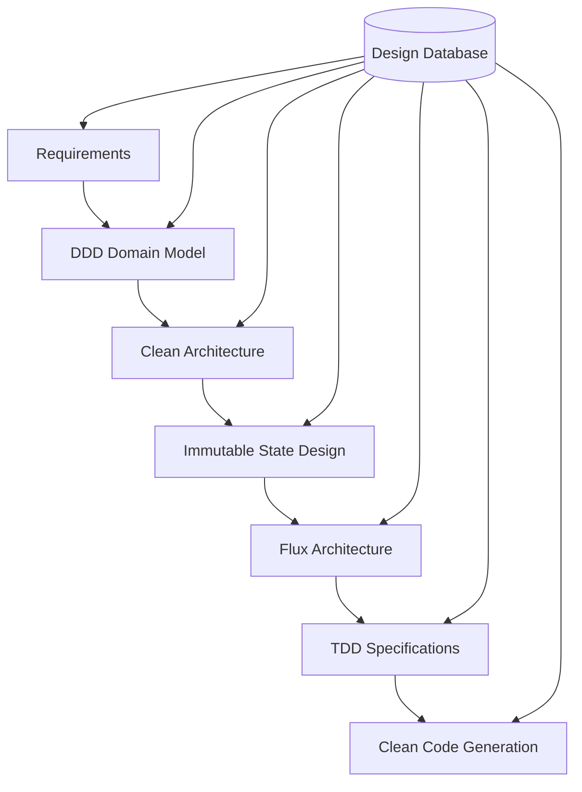

# SD - Software Design Methodology Package

> **AI-Autonomous Software Development with Legion DecentPlanner Integration**

**Database-Centric Design Methodology**: DDD + Clean Architecture + Immutable Design + Flux + TDD + Clean Code

## 🤖 Legion DecentPlanner Integration

The SD package is fully integrated with Legion's hierarchical task decomposition system, enabling autonomous software development from high-level goals to deployable applications.

### Key Integration Features:
- **Hierarchical Planning**: Uses DecentPlanner for intelligent task decomposition
- **Methodology-Driven Decomposition**: Breaks down development goals using SD's six methodologies
- **Behavior Tree Generation**: Creates executable development workflows
- **Tool Integration**: All SD tools are available to the planner for autonomous execution
- **Quality Gates**: Automated validation at each methodology phase

## 🎯 Overview

The SD package implements a comprehensive, AI-assisted software design methodology that stores every design artifact, decision, and relationship in a structured database. This enables full traceability from requirements to deployed code, automated quality validation, and intelligent design pattern reuse.

## 🏗️ Methodology Stack



### Core Methodologies:
- **🏛️ Domain-Driven Design (DDD)** - Bounded contexts, entities, domain services
- **🧹 Clean Architecture** - Layered architecture with dependency inversion
- **🔒 Immutable Design** - Pure functions and immutable data structures
- **🔄 Flux Architecture** - Unidirectional data flow and predictable state
- **✅ Test-Driven Development (TDD)** - Tests as specifications and documentation
- **📐 Clean Code Principles** - SOLID principles and code quality metrics

## 🚀 Quick Start

```bash
# Install dependencies
npm install

# Run the interactive workflow demo
npm run workflow:demo

# Generate a complete example project
npm run generate:example -- --type=web-app --name=my-project

# Run all tests
npm test

# View comprehensive documentation
open docs/DESIGN_METHODOLOGY.md
```

## 📊 Key Features

### ✨ AI-Assisted Design
- **Requirements Analysis** - Automated extraction of user stories and domain rules
- **Domain Modeling** - AI-generated bounded contexts and entity relationships
- **Architecture Generation** - Clean architecture layer and dependency creation
- **Test Specification** - Comprehensive TDD test generation
- **Code Generation** - Clean code following all methodology principles

### 🗄️ Database-Centric Approach
- **Complete Traceability** - Every artifact linked from requirements to code
- **Version Control** - Full history of design decisions and changes
- **Impact Analysis** - Understand the effect of changes across the system
- **Pattern Reuse** - Learn from successful implementations
- **Quality Metrics** - Automated quality tracking and validation

### 🔄 Top-Down Workflow
```
Requirements → Domain Model → Architecture → State Design → Tests → Implementation
     ↓            ↓             ↓            ↓         ↓           ↓
   Database   Database     Database     Database  Database   Database
```

## 🛠️ Architecture

### Core Components

```javascript
import { SDModule } from '@legion/sd';
import { ResourceManager } from '@legion/resource-manager';

// Initialize with Legion integration
const resourceManager = ResourceManager.getInstance();
const sd = await SDModule.create(resourceManager);

// Plan software development using DecentPlanner
const planResult = await sd.planDevelopment(
  "Build a scalable todo management system with user authentication",
  {
    requirements: "User registration, task CRUD, real-time updates",
    constraints: ["Must use JWT tokens", "Must be scalable"]
  }
);

// Execute the planned workflow
if (planResult.success) {
  console.log('Planning phases:', planResult.phases);
  console.log('Behavior trees:', planResult.phases.formal?.behaviorTrees);
}
```

### Database Collections

| Collection | Purpose | Artifacts |
|------------|---------|-----------|
| `projects` | Project management | Versions, teams, stakeholders |
| `requirements` | Requirements analysis | User stories, acceptance criteria |
| `domain_entities` | DDD artifacts | Entities, value objects, services |
| `use_cases` | Clean architecture | Use cases, interfaces, layers |
| `immutable_structures` | State design | Immutable objects, transformations |
| `flux_stores` | Flux architecture | Actions, stores, reducers |
| `test_specifications` | TDD artifacts | Test cases, specifications |
| `generated_code` | Implementation | Generated code, configurations |
| `traceability_matrix` | Relationships | Full artifact traceability |
| `design_decisions` | Decision log | Rationale, alternatives, trade-offs |

## 📚 Documentation

### Complete Documentation Suite
- **[Design Methodology](docs/DESIGN_METHODOLOGY.md)** - 50+ page comprehensive design specification
- **[Implementation Plan](docs/IMPLEMENTATION_PLAN.md)** - 30+ page detailed implementation roadmap  
- **[Database Schema](docs/DATABASE_SCHEMA.md)** - Complete MongoDB schema reference
- **[API Reference](docs/API_REFERENCE.md)** - Tool and API documentation
- **[Workflow Guide](docs/WORKFLOW_GUIDE.md)** - Step-by-step workflow usage

### Examples
- **[Todo App](examples/todo-app/)** - Complete todo application using SD methodology
- **[E-Commerce](examples/e-commerce/)** - E-commerce platform implementation
- **[API Gateway](examples/api-gateway/)** - Microservice gateway example

## 🧪 Testing

```bash
# Run all tests with coverage
npm run test:coverage

# Run specific test suites
npm run test:unit        # Unit tests
npm run test:integration # Integration tests
npm run test:e2e         # End-to-end workflow tests

# Watch mode for development
npm run test:watch
```

## 🎯 Usage Examples

### 1. Autonomous Planning with DecentPlanner
```javascript
import { SDModule } from '@legion/sd';
import { ResourceManager } from '@legion/resource-manager';

// Initialize SD module with full Legion integration
const resourceManager = ResourceManager.getInstance();
const sdModule = await SDModule.create(resourceManager);

// Plan a complex development goal
const planResult = await sdModule.planDevelopment(
  "Build a real-time chat application with user authentication and message history",
  {
    requirements: [
      "User registration and login",
      "Real-time messaging between users", 
      "Message history persistence",
      "Online user status",
      "Group chat functionality"
    ],
    constraints: ["Must use WebSockets", "Must be scalable to 10k users"],
    architecture: "clean-architecture",
    methodology: "full-sd-6"
  }
);

// Check planning results
if (planResult.success) {
  console.log('✅ Planning successful!');
  console.log('📋 Decomposed into phases:', planResult.phases.informal.hierarchy);
  console.log('🌳 Behavior trees generated:', planResult.phases.formal?.behaviorTrees?.length);
  console.log('🛠️ Tools identified:', planResult.context.toolset);
} else {
  console.error('❌ Planning failed:', planResult.error);
}
```

### 2. Profile-Specific Planning
```javascript
// Use specific methodology profiles for targeted planning
const requirementsResult = await sdModule.profileManager.planWithProfile(
  'sd-requirements',
  "Analyze user authentication requirements for enterprise application"
);

const architectureResult = await sdModule.profileManager.planWithProfile(
  'sd-architecture',
  "Design clean architecture for microservices with event sourcing"
);

const implementationResult = await sdModule.profileManager.planWithProfile(
  'sd-implementation', 
  "Implement user service with TDD and clean code principles"
);
```

### 3. Requirements Analysis
```javascript
import { RequirementsAnalyzer } from '@legion/sd';

const analyzer = new RequirementsAnalyzer();
const requirements = await analyzer.analyze({
  input: "Users should be able to create, edit, and delete todos",
  project: "todo-app"
});

// Generated requirements with domain rules
console.log(requirements.userStories);
console.log(requirements.acceptanceCriteria);
console.log(requirements.domainRules);
```

### 2. Domain Modeling
```javascript
import { DomainModeler } from '@legion/sd';

const modeler = new DomainModeler();
const domainModel = await modeler.createModel({
  requirements: requirementsId,
  project: "todo-app"
});

// Generated DDD artifacts
console.log(domainModel.boundedContexts);
console.log(domainModel.entities);
console.log(domainModel.domainServices);
```

### 3. Complete Workflow
```javascript
import { TopDownWorkflow } from '@legion/sd';

const workflow = new TopDownWorkflow();
const result = await workflow.execute({
  projectName: "Advanced Todo App",
  requirements: "Build a collaborative todo management system with real-time updates",
  methodology: {
    ddd: true,
    cleanArchitecture: true,
    immutableDesign: true,
    flux: true,
    tdd: true,
    cleanCode: true
  }
});

// Complete implementation with full traceability
console.log(result.generatedArtifacts);
console.log(result.codeGenerated);
console.log(result.testsCreated);
console.log(result.qualityMetrics);
```

## 🔧 Configuration

### Database Configuration
```javascript
// sd.config.js
export default {
  database: {
    uri: process.env.SD_DATABASE_URI || 'mongodb://localhost:27017/sd-design',
    options: {
      useNewUrlParser: true,
      useUnifiedTopology: true
    }
  },
  ai: {
    provider: 'anthropic',
    model: 'claude-3-sonnet-20241022',
    apiKey: process.env.ANTHROPIC_API_KEY
  },
  methodology: {
    phases: ['requirements', 'domain', 'architecture', 'state', 'tests', 'implementation'],
    qualityGates: true,
    automatedValidation: true
  }
};
```

## 🤝 Integration

### Legion DecentPlanner Integration
```javascript
import { SDModule } from '@legion/sd';
import { ResourceManager } from '@legion/resource-manager';

// Initialize SD module with full Legion integration
const resourceManager = ResourceManager.getInstance();
const sdModule = await SDModule.create(resourceManager);

// Get the integrated DecentPlanner
const planner = sdModule.getPlanner();

// Plan with SD methodology context
const planResult = await sdModule.planDevelopment(
  "Build a microservice architecture with event sourcing",
  {
    architecture: 'microservices',
    patterns: ['event-sourcing', 'cqrs'],
    methodology: 'full-sd-6-methodology'
  }
);

// Use specific planning profiles
const requirementsResult = await sdModule.profileManager.planWithProfile(
  'sd-requirements', 
  "Analyze requirements for user management system"
);
```

## 🎯 Benefits

### For Development Teams
- **📈 Faster Development** - Reuse proven design patterns and architectures
- **🔍 Full Traceability** - Understand impact of changes from requirements to code
- **✅ Quality Assurance** - Automated validation of design and code quality
- **📚 Living Documentation** - Always up-to-date design documentation
- **🤖 AI Assistance** - Intelligent suggestions and automated generation

### For Project Management
- **📊 Progress Tracking** - Real-time visibility into design and development progress
- **⚠️ Risk Mitigation** - Early identification of architectural issues
- **📋 Requirements Management** - Clear traceability from requirements to features
- **🔄 Change Management** - Impact analysis for requirement changes

### For Architecture Teams
- **🏗️ Consistent Architecture** - Enforced architectural patterns across projects
- **📐 Design Standards** - Automated compliance with design principles
- **🔄 Architecture Evolution** - Track and manage architectural changes
- **🎯 Best Practices** - Capture and reuse successful architectural patterns

## 📈 Roadmap

### Phase 1: Foundation ✅
- Core database schema and collections 
- Legion DecentPlanner integration
- All six methodology tools implemented
- Hierarchical task decomposition
- Behavior tree generation for development workflows

### Phase 2: Advanced Features ✅  
- Real-time observability with chat intelligence
- MongoDB change streams for live monitoring
- Comprehensive artifact tracking and relationships
- Automated quality validation at each phase

### Phase 3: Autonomous Development 🚧
- Full end-to-end autonomous code generation
- Machine learning for pattern recognition and optimization
- Multi-project architecture management
- Enterprise-grade security and compliance

## 🤝 Contributing

We welcome contributions! Please see our [Contributing Guide](CONTRIBUTING.md) for details.

## 📄 License

MIT License - see [LICENSE](LICENSE) file for details.

---

**Built with ❤️ by the Legion Team**

*Revolutionizing software development through AI-assisted design methodology*