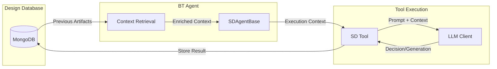
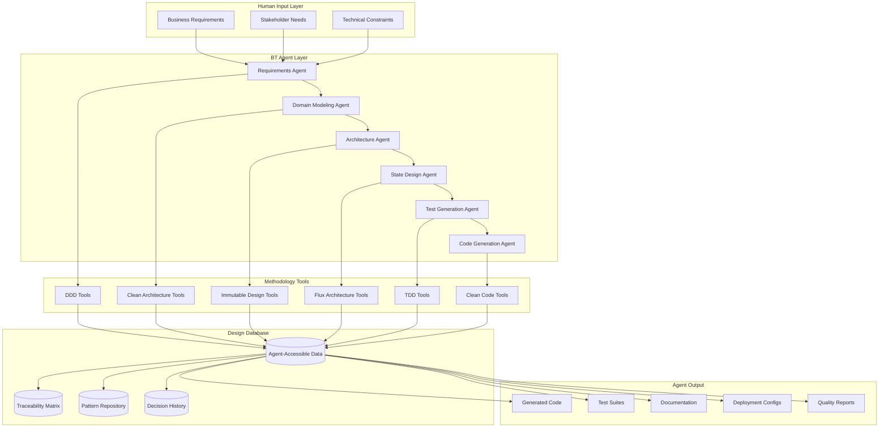
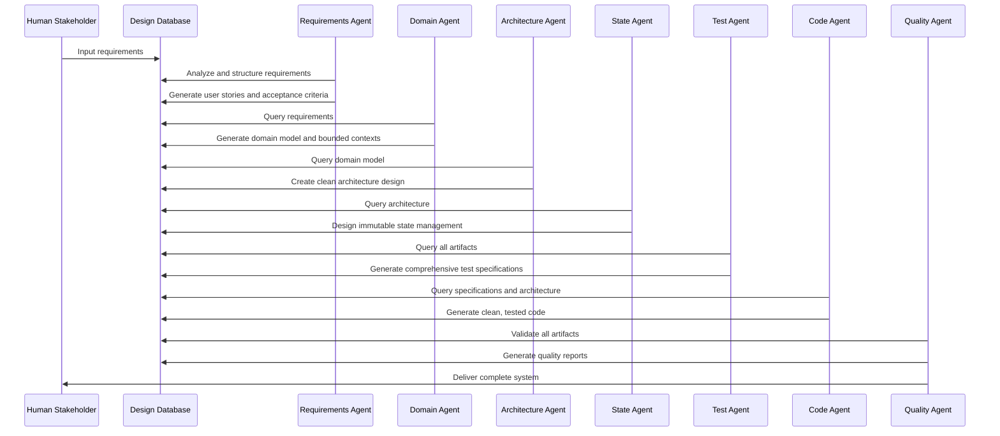
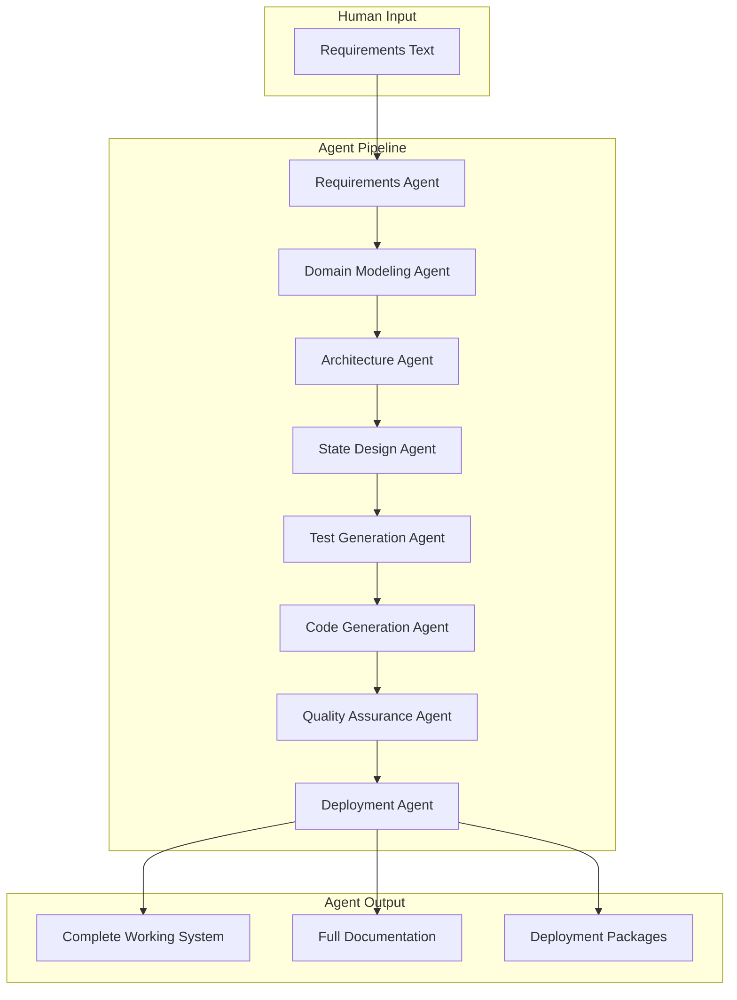
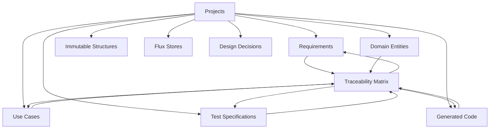

# Software Design Methodology for Autonomous AI Agents
## Legion Extension: SD Package for Agent-Driven Development
### BT Actors Execute: DDD + Clean Architecture + Immutable Design + Flux + TDD + Clean Code

---

**Document Version:** 2.0.0  
**Last Updated:** August 2025  
**Authors:** Legion Team  
**Status:** Approved  
**Foundation:** Built on Legion BT Actor Infrastructure  

---

## Table of Contents

1. [Executive Summary](#executive-summary)
2. [Methodology Stack Overview](#methodology-stack-overview)
3. [Architecture Philosophy](#architecture-philosophy)
4. [Database Schema Design](#database-schema-design)
5. [Top-Down Workflow Design](#top-down-workflow-design)
6. [AI Legion Integration](#ai-legion-integration)
7. [Quality Assurance Framework](#quality-assurance-framework)
8. [Implementation Guidelines](#implementation-guidelines)
9. [Technical Specifications](#technical-specifications)
10. [Benefits and Value Proposition](#benefits-and-value-proposition)
11. [Case Studies](#case-studies)
12. [Future Roadmap](#future-roadmap)

---

## Executive Summary

**CRITICAL: This is a Legion Extension Using BT Actors**

The Software Design (SD) package extends the existing Legion framework's BT Actor infrastructure to enable **autonomous software development**. All SD agents are specialized BTAgentBase subclasses that leverage Legion's existing tool system, planning infrastructure, and resource management.

**Key Foundation Components from Legion:**
- **BTAgentBase** - All SD agents extend this base class from `@legion/bt-task`
- **Tool Class** - All SD tools extend Legion's Tool class from `@legion/tools-registry`
- **PlannerEngine** - SD uses the existing planner from `@legion/unified-planner`
- **ProfilePlanner** - SD extends profiles from `@legion/profile-planner`
- **ResourceManager** - Singleton resource management with automatic .env loading
- **ModuleLoader** - Standard Legion module and tool registration
- **BehaviorTreeExecutor** - Executes agent BT workflows Agents handle:

- **Requirements Analysis** - Agents parse, structure, and validate requirements
- **Domain Modeling** - Agents identify bounded contexts and create domain models  
- **Architecture Design** - Agents design clean architecture with proper layers
- **State Management** - Agents design immutable state and data flow
- **Test Generation** - Agents create comprehensive test specifications
- **Code Generation** - Agents write all production code
- **Quality Assurance** - Agents validate methodology compliance
- **Documentation** - Agents generate all documentation
- **Deployment** - Agents create deployment configurations

**No human writes code. No human makes design decisions. Agents do everything.**

### Core Innovation: "Legion BT Actors + Database-Centric Design"

The SD package extends Legion's proven BT Actor system to create specialized agents for software development. Rather than building new infrastructure, SD leverages:

**Legion's Existing Infrastructure:**
- **BT Actor System** - Agents inherit full Actor protocol and BT execution capabilities
- **Tool Registry** - SD tools integrate with Legion's ModuleLoader and tool discovery
- **Planning System** - SD extends ProfilePlanner and UnifiedPlanner with SD-specific profiles
- **Resource Management** - Uses Legion's ResourceManager for dependency injection

Our methodology creates **specialized BT Actors** that treat **design as structured data** stored in a MongoDB database:

**For Legion BT Actors:**
- Every requirement is stored as structured data BT Actors can analyze and extend
- Every architectural decision is captured with rationale agents can evaluate
- Every piece of generated code is linked to design origins agents can trace
- Every test is connected to requirements agents can validate
- Every change is tracked with impact analysis agents can compute
- Every methodology principle is encoded as rules agents can enforce
- Every successful pattern is stored for agents to reuse and adapt

---

## Integration with Legion Infrastructure

### Building on the Legion Foundation

The SD package is **NOT a standalone system** but a specialized extension of the Legion framework. Every component builds on existing Legion infrastructure:

#### 1. BT Actor Inheritance Hierarchy
```
Legion Actor (base class)
    ↓
BTAgentBase (@legion/bt-task)
    ↓
SDAgentBase (SD package base)
    ↓
[RequirementsAgent, DomainAgent, ArchitectureAgent, etc.]
```

#### 2. Tool Infrastructure
```
Legion Tool (base class from @legion/tools-registry)
    ↓
[RequirementParserTool, EntityModelingTool, CodeGeneratorTool, etc.]
```

#### 3. Planning Integration
```
PlannerEngine (@legion/unified-planner)
    ↓ uses
LLMStrategy (generates BT plans)
    ↓ extends with
SD-specific planning profiles and templates
```

### How SD Agents Extend BTAgentBase

```javascript
// All SD agents inherit from BTAgentBase
class SDAgentBase extends BTAgentBase {
  constructor(config) {
    super(config); // Inherits all BT Actor capabilities
    
    // SD-specific additions
    this.designDatabase = config.designDatabase;
    this.methodologyRules = config.methodologyRules;
  }
  
  // Inherits from BTAgentBase:
  // - BT workflow execution via BehaviorTreeExecutor
  // - Actor protocol for inter-agent communication
  // - Tool registry access through ModuleLoader
  // - Session management and remote actor connections
  
  // SD-specific methods
  async storeArtifact(artifact) {
    return this.designDatabase.store(artifact);
  }
}
```

### How SD Tools Follow Legion Patterns

```javascript
// All SD tools extend Legion's Tool class
class RequirementParserTool extends Tool {
  constructor(dependencies) {
    super({
      name: 'requirement_parser',
      execute: async (input) => this.parseRequirements(input),
      inputSchema: z.object({
        rawText: z.string(),
        context: z.object({}).optional()
      })
    });
    
    // Uses ResourceManager for dependencies
    this.llmClient = dependencies.resourceManager.get('llmClient');
  }
  
  // Tool execution follows Legion patterns
  async parseRequirements(input) {
    this.emit('progress', { message: 'Parsing requirements...', percentage: 0 });
    // Implementation...
    return { success: true, data: parsedRequirements };
  }
}
```

### Integration Points with Existing Legion Systems

1. **ModuleLoader Integration**
   - SD module registers with Legion's ModuleLoader
   - All SD tools are discoverable through standard tool registry
   - Tools work with existing Aiur server infrastructure

2. **Planning System Integration**
   - SD extends ProfilePlanner with software development profiles
   - Uses UnifiedPlanner's LLMStrategy for BT generation
   - Plans are validated with BTValidator

3. **Resource Management**
   - ResourceManager provides singleton dependency injection
   - Automatic .env loading for API keys
   - No manual resource registration needed

4. **Actor Communication**
   - SD agents use Actor protocol for coordination
   - ActorSpace manages agent instances
   - Channel handles inter-agent messaging

---

## LLM Integration and Context Management

### LLM Decision Points vs Deterministic Logic

The SD system strategically uses LLM for creative and analytical decisions while using deterministic logic for structured operations:

#### LLM-Powered Decisions (Require AI Reasoning)
- **Requirements Analysis** - Parsing natural language, understanding intent
- **Domain Modeling** - Identifying entities, bounded contexts, relationships
- **Architecture Design** - Selecting patterns, designing interfaces
- **Code Generation** - Writing actual implementation code
- **Test Creation** - Generating test scenarios and edge cases
- **Quality Assessment** - Evaluating code quality and methodology compliance

#### Deterministic Operations (Rule-Based)
- **Database Operations** - CRUD operations on design artifacts
- **Workflow Orchestration** - BT execution flow control
- **Schema Validation** - Checking against defined schemas
- **Traceability Updates** - Maintaining relationship matrix
- **Metric Calculations** - Computing quality scores
- **File Operations** - Reading/writing generated code

### Context Flow Architecture



### How Agents Retrieve and Provide Context

```javascript
class DomainModelingAgent extends SDAgentBase {
  // Override to provide domain-specific context
  createExecutionContext(payload, envelope) {
    const baseContext = super.createExecutionContext(payload, envelope);
    
    return {
      ...baseContext,
      // Context retrieval from design database
      getProjectContext: async () => {
        const requirements = await this.designDatabase.getRequirements(payload.projectId);
        const existingDomain = await this.designDatabase.getDomainModel(payload.projectId);
        const patterns = await this.designDatabase.getSuccessfulPatterns('domain');
        
        return {
          requirements,
          existingDomain,
          patterns,
          methodologyRules: this.methodologyRules.domain
        };
      }
    };
  }
}
```

### How Tools Access LLM with Context

```javascript
class EntityModelingTool extends Tool {
  constructor(dependencies) {
    super({
      name: 'entity_modeling',
      execute: async (input) => this.modelEntities(input),
      inputSchema: z.object({
        requirements: z.array(z.object({})),
        projectId: z.string()
      })
    });
    
    // LLM client from ResourceManager
    this.llmClient = dependencies.resourceManager.get('llmClient');
  }
  
  async modelEntities(input) {
    // Get context passed from agent
    const context = input.context || await input.getProjectContext();
    
    // Build prompt with methodology rules and context
    const prompt = this.buildPrompt(context);
    
    // LLM decision with focused context
    const response = await this.llmClient.complete({
      prompt,
      model: 'claude-3-5-sonnet-20241022',
      temperature: 0.3, // Lower for consistency
      system: 'You are a DDD expert. Generate domain entities following DDD principles.'
    });
    
    // Parse and validate LLM response
    const entities = this.parseEntities(response);
    
    // Store with decision rationale
    return {
      success: true,
      data: {
        entities,
        rationale: response.rationale,
        contextUsed: context.requirements.map(r => r.id)
      }
    };
  }
  
  buildPrompt(context) {
    return `
    Based on these requirements:
    ${JSON.stringify(context.requirements, null, 2)}
    
    Following DDD principles:
    - Entities have identity that persists
    - Value objects are immutable
    - Aggregates maintain consistency boundaries
    
    Existing domain model (if any):
    ${JSON.stringify(context.existingDomain, null, 2)}
    
    Successful patterns from similar projects:
    ${JSON.stringify(context.patterns, null, 2)}
    
    Generate domain entities with:
    1. Clear identity properties
    2. Defined invariants
    3. Aggregate boundaries
    4. Domain events
    
    Return as JSON with rationale for each decision.
    `;
  }
}
```

### Planning Integration with LLM

```javascript
// SD extends ProfilePlanner with software development profiles
class SDPlanningProfile {
  static getProfile() {
    return {
      name: 'software-development',
      description: 'Complete software development lifecycle',
      
      // Context provided to LLM for workflow generation
      contextPrompt: `
        You are planning a software development project following:
        - Domain-Driven Design (DDD)
        - Clean Architecture
        - Immutable Design
        - Flux Architecture
        - Test-Driven Development (TDD)
        - Clean Code principles
        
        Generate a behavior tree workflow that:
        1. Analyzes requirements
        2. Models the domain
        3. Designs architecture
        4. Creates tests
        5. Generates code
        6. Validates quality
      `,
      
      // Available tools for this profile
      allowableActions: [
        { tool: 'requirement_parser', description: 'Parse natural language requirements' },
        { tool: 'entity_modeling', description: 'Create DDD domain model' },
        { tool: 'architecture_design', description: 'Design clean architecture' },
        { tool: 'test_generation', description: 'Generate TDD test specs' },
        { tool: 'code_generation', description: 'Generate implementation code' },
        { tool: 'quality_validation', description: 'Validate methodology compliance' }
      ]
    };
  }
}
```

### Context Enrichment Strategy

Each agent enriches context for the next:

1. **RequirementsAgent** → Provides structured requirements
2. **DomainAgent** → Adds domain model to context
3. **ArchitectureAgent** → Adds architectural decisions
4. **TestAgent** → Adds test specifications
5. **CodeAgent** → Uses full context for generation
6. **QAAgent** → Validates using complete context

### LLM Response Storage

All LLM decisions are stored with:
- **Decision** - What was decided
- **Rationale** - Why it was decided (from LLM)
- **Context Used** - What artifacts influenced the decision
- **Confidence** - LLM confidence score
- **Alternatives** - Other options considered
- **Timestamp** - When decision was made

```javascript
// Stored in design database
{
  _id: ObjectId(),
  projectId: 'proj-123',
  agentType: 'domain',
  decisionType: 'entity_identification',
  decision: {
    entities: ['User', 'Todo', 'Project'],
    aggregates: ['UserAggregate', 'ProjectAggregate']
  },
  rationale: 'User and Todo are core domain entities based on requirements...',
  contextUsed: ['req-1', 'req-2', 'req-3'],
  confidence: 0.92,
  alternatives: ['Could model Todo as value object but...'],
  timestamp: new Date(),
  llmModel: 'claude-3-5-sonnet-20241022'
}
```

### AI Agent Methodology Stack



### Key Benefits for AI Agent Development

1. **Autonomous Development**: BT agents can execute complete software projects without human intervention
2. **Complete Traceability**: Every line of code traced back to requirements by agents
3. **Design Consistency**: Agents automatically validate and enforce all methodology principles
4. **Knowledge Preservation**: Design decisions captured in agent-readable structured format
5. **Pattern Recognition**: Agents automatically identify, learn from, and reuse successful patterns
6. **Impact Analysis**: Agents compute full effect of changes across all artifacts
7. **Quality Assurance**: Continuous validation by specialized quality agents
8. **Scalable Development**: Multiple agent teams can work on complex projects simultaneously
9. **Learning System**: Agents improve methodology application through pattern analysis
10. **Methodology Compliance**: Agents enforce all six methodologies consistently

---

## Methodology Stack Overview

### 1. Domain-Driven Design (DDD) - Agent Tools

**Purpose**: Enable BT agents to automatically align software models with business domains through AI-powered analysis of ubiquitous language and bounded context identification.

**Agent Tool Capabilities**:
- **Bounded Context Detection**: Agents automatically identify domain boundaries from requirements
- **Entity Extraction**: Agents recognize domain entities and their identity characteristics
- **Value Object Identification**: Agents detect immutable domain concepts and their attributes
- **Aggregate Boundary Analysis**: Agents determine consistency boundaries and aggregate roots
- **Domain Service Recognition**: Agents identify stateless domain operations
- **Repository Pattern Generation**: Agents create appropriate repository interfaces
- **Domain Event Modeling**: Agents identify and model significant business events

**Agent-Accessible DDD Tools**:
- **DomainAnalysisTool**: Analyzes requirements text to extract domain concepts
- **BoundedContextGeneratorTool**: Creates bounded contexts with proper boundaries
- **EntityModelingTool**: Generates entities with proper invariants and behavior
- **UbiquitousLanguageBuilderTool**: Builds consistent domain vocabulary
- **DomainEventExtractorTool**: Identifies and models domain events

**Database Artifacts**:
```javascript
// Bounded Context
{
  name: "OrderManagement",
  description: "Handles order lifecycle from creation to fulfillment",
  ubiquitousLanguage: {
    "Order": "A customer's request for products with payment",
    "OrderLine": "Individual product and quantity within an order",
    "OrderStatus": "Current state of order processing"
  },
  relationships: [
    { context: "Payment", relationship: "customer_supplier" },
    { context: "Inventory", relationship: "conformist" }
  ]
}

// Domain Entity
{
  name: "Order",
  type: "aggregate_root",
  boundedContext: "OrderManagement", 
  properties: [
    { name: "id", type: "OrderId", immutable: true },
    { name: "customerId", type: "CustomerId", required: true },
    { name: "orderLines", type: "List<OrderLine>", required: true },
    { name: "status", type: "OrderStatus", required: true }
  ],
  invariants: [
    "Order must have at least one order line",
    "Total amount must be positive",
    "Cannot modify completed orders"
  ]
}
```

### 2. Clean Architecture - Agent Tools

**Purpose**: Enable BT agents to automatically create systems with proper architectural layers, dependency inversion, and framework independence.

**What Agents Do**:
- **Dependency Inversion**: Core business logic depends on abstractions, not concrete implementations
- **Layered Architecture**: Clear separation of concerns across architectural layers
- **Use Cases**: Application-specific business rules isolated from technical concerns
- **Interface Adapters**: Convert data between use cases and external systems
- **Frameworks and Drivers**: External tools and frameworks at the outermost layer

**Architecture Layers**:
1. **Domain Layer**: Entities, value objects, domain services (innermost)
2. **Application Layer**: Use cases, application services
3. **Infrastructure Layer**: Database, external APIs, frameworks
4. **Presentation Layer**: UI, controllers, API endpoints (outermost)

**Database Artifacts**:
```javascript
// Use Case
{
  name: "CreateOrderUseCase",
  layer: "application",
  description: "Creates a new customer order",
  inputs: [
    { name: "customerId", type: "CustomerId", required: true },
    { name: "orderItems", type: "List<OrderItem>", required: true }
  ],
  outputs: [
    { name: "order", type: "Order" },
    { name: "events", type: "List<DomainEvent>" }
  ],
  preconditions: [
    "Customer exists and is active",
    "All order items are available",
    "Customer has valid payment method"
  ],
  postconditions: [
    "Order is created and persisted",
    "OrderCreated event is published",
    "Inventory is reserved"
  ],
  dependencies: [
    { interface: "CustomerRepository", type: "input_port" },
    { interface: "OrderRepository", type: "output_port" },
    { interface: "InventoryService", type: "output_port" }
  ]
}

// Interface Definition
{
  name: "OrderRepository",
  type: "repository",
  layer: "domain",
  operations: [
    {
      name: "save",
      inputs: [{ name: "order", type: "Order" }],
      outputs: [{ name: "savedOrder", type: "Order" }],
      throws: ["PersistenceException", "ConcurrencyException"]
    },
    {
      name: "findById", 
      inputs: [{ name: "orderId", type: "OrderId" }],
      outputs: [{ name: "order", type: "Optional<Order>" }]
    }
  ]
}
```

### 3. Immutable Design

**Purpose**: Create predictable, thread-safe applications through immutable data structures and pure functions.

**Key Concepts**:
- **Immutable Objects**: Objects that cannot be modified after creation
- **Pure Functions**: Functions with no side effects that always return same output for same input
- **State Transitions**: Change through creating new objects rather than modifying existing ones
- **Event Sourcing**: Store changes as sequence of events rather than current state
- **Functional Composition**: Build complex behavior from simple, pure functions

**Database Artifacts**:
```javascript
// Immutable Structure
{
  name: "OrderState",
  type: "immutable_object",
  properties: [
    { name: "orders", type: "ImmutableList<Order>", updateMethod: "withOrders" },
    { name: "selectedOrder", type: "Optional<Order>", updateMethod: "withSelectedOrder" },
    { name: "filter", type: "OrderFilter", updateMethod: "withFilter" }
  ],
  stateTransitions: [
    {
      from: "EmptyOrderState",
      to: "OrdersLoadedState", 
      trigger: "OrdersLoaded",
      transformation: "replace orders list with loaded orders"
    },
    {
      from: "OrdersLoadedState",
      to: "OrderSelectedState",
      trigger: "OrderSelected", 
      transformation: "set selectedOrder to clicked order"
    }
  ]
}

// Pure Function
{
  name: "calculateOrderTotal",
  inputs: [{ name: "orderLines", type: "List<OrderLine>" }],
  outputs: [{ name: "total", type: "Money" }],
  sideEffects: [], // Must be empty for pure functions
  implementation: `
    return orderLines
      .map(line => line.price.multiply(line.quantity))
      .reduce((sum, amount) => sum.add(amount), Money.ZERO);
  `,
  testCases: [
    {
      input: "[OrderLine(price: $10, qty: 2), OrderLine(price: $5, qty: 1)]",
      expectedOutput: "$25",
      description: "Should sum all line totals correctly"
    }
  ]
}
```

### 4. Flux Architecture

**Purpose**: Manage application state through unidirectional data flow for predictable state management.

**Key Concepts**:
- **Unidirectional Data Flow**: Actions → Dispatcher → Stores → Views → Actions
- **Actions**: Describe what happened in the application
- **Stores**: Hold application state and business logic
- **Dispatcher**: Central hub managing data flow
- **Views**: React to store changes and dispatch actions

**Data Flow**:
```
User Interaction → Action Creator → Action → Dispatcher → Store → View Update
      ↑                                                            ↓
      ←←←←←←←←←←←← View renders updated state ←←←←←←←←←←←←←←←←←←←←←←←
```

**Database Artifacts**:
```javascript
// Flux Action
{
  name: "CREATE_ORDER",
  type: "async",
  payload: {
    customerId: { type: "String", required: true },
    orderItems: { type: "Array<OrderItem>", required: true },
    shippingAddress: { type: "Address", required: true }
  },
  metadata: {
    timestamp: { type: "Date", auto: true },
    userId: { type: "String", required: true },
    correlationId: { type: "String", auto: true }
  },
  sideEffects: [
    "API call to order service",
    "Inventory reservation",
    "Payment processing initiation"
  ],
  relatedActions: [
    "CREATE_ORDER_SUCCESS",
    "CREATE_ORDER_FAILURE", 
    "RESERVE_INVENTORY",
    "PROCESS_PAYMENT"
  ]
}

// Flux Store
{
  name: "OrderStore",
  stateShape: {
    orders: { type: "ImmutableList<Order>", defaultValue: "[]" },
    selectedOrder: { type: "Optional<Order>", defaultValue: "null" },
    loading: { type: "Boolean", defaultValue: "false" },
    error: { type: "Optional<String>", defaultValue: "null" },
    filter: { type: "OrderFilter", defaultValue: "OrderFilter.ALL" }
  },
  reducers: [
    {
      action: "CREATE_ORDER",
      logic: "set loading = true, clear error",
      immutableUpdate: true,
      implementation: `
        return state.withLoading(true)
                   .withError(null);
      `
    },
    {
      action: "CREATE_ORDER_SUCCESS", 
      logic: "add new order to list, set loading = false",
      immutableUpdate: true,
      implementation: `
        return state.withOrders(state.orders.prepend(action.payload.order))
                   .withLoading(false);
      `
    }
  ],
  selectors: [
    {
      name: "getVisibleOrders",
      inputs: ["state", "filter"],
      logic: "filter orders based on current filter criteria",
      memoized: true
    }
  ]
}
```

### 5. Test-Driven Development (TDD)

**Purpose**: Drive design through tests, ensuring code meets requirements and is thoroughly validated.

**TDD Cycle**:
1. **Red**: Write a failing test that specifies desired behavior
2. **Green**: Write minimal code to make the test pass  
3. **Refactor**: Improve code design while keeping tests passing

**Test Types**:
- **Unit Tests**: Test individual components in isolation
- **Integration Tests**: Test component interactions
- **Acceptance Tests**: Test complete user scenarios
- **Property-Based Tests**: Test with generated inputs to find edge cases

**Database Artifacts**:
```javascript
// Test Specification
{
  name: "should create order with valid data",
  type: "unit",
  phase: "green",
  description: "CreateOrderUseCase should successfully create order when given valid input",
  relatedRequirement: ObjectId("req_create_order"),
  relatedUseCase: ObjectId("usecase_create_order"),
  testCode: `
    test('should create order with valid data', async () => {
      // Arrange
      const customerId = new CustomerId('cust-123');
      const orderItems = [new OrderItem('prod-1', 2, Money.of(10))];
      const mockCustomerRepo = new MockCustomerRepository();
      const mockOrderRepo = new MockOrderRepository();
      
      const useCase = new CreateOrderUseCase(mockCustomerRepo, mockOrderRepo);
      
      // Act
      const result = await useCase.execute(customerId, orderItems);
      
      // Assert
      expect(result.isSuccess()).toBe(true);
      expect(result.order.customerId).toEqual(customerId);
      expect(result.order.orderLines).toHaveLength(1);
      expect(mockOrderRepo.saveCallCount).toBe(1);
    });
  `,
  assertions: [
    "Result should be successful",
    "Order should have correct customer ID",
    "Order should have correct number of lines",
    "Order should be persisted"
  ],
  status: "passing",
  lastRun: new Date(),
  executionTime: 15,
  coverage: {
    lines: 95,
    functions: 100,
    branches: 87
  }
}

// Acceptance Test
{
  name: "Customer can place order end-to-end",
  type: "acceptance", 
  description: "Complete user journey from product selection to order confirmation",
  userStory: ObjectId("story_place_order"),
  scenario: `
    Given a customer is logged in
    And products are available in inventory
    When the customer adds items to cart
    And proceeds to checkout
    And provides shipping information
    And confirms the order
    Then the order should be created
    And inventory should be updated
    And confirmation email should be sent
  `,
  steps: [
    { step: "Login customer", endpoint: "POST /api/auth/login" },
    { step: "Add to cart", endpoint: "POST /api/cart/items" },
    { step: "Checkout", endpoint: "POST /api/orders" },
    { step: "Verify order", endpoint: "GET /api/orders/:id" },
    { step: "Check inventory", endpoint: "GET /api/products/:id" }
  ]
}
```

### 6. Clean Code Principles

**Purpose**: Write maintainable, readable code that clearly expresses intent and follows established best practices.

**SOLID Principles**:
- **Single Responsibility**: Each class has one reason to change
- **Open/Closed**: Open for extension, closed for modification
- **Liskov Substitution**: Derived classes must be substitutable for base classes
- **Interface Segregation**: Clients shouldn't depend on interfaces they don't use
- **Dependency Inversion**: Depend on abstractions, not concretions

**Clean Code Practices**:
- **Meaningful Names**: Variables, functions, and classes have descriptive names
- **Small Functions**: Functions do one thing and do it well
- **Clear Comments**: Code is self-documenting, comments explain why not what
- **Error Handling**: Proper exception handling without returning null
- **Formatting**: Consistent code formatting and structure

**Database Artifacts**:
```javascript
// Code Quality Metrics
{
  componentId: ObjectId("order_entity"),
  componentName: "Order.js",
  metrics: {
    linesOfCode: 156,
    cyclomaticComplexity: 8,
    functionCount: 12,
    averageFunctionLength: 8,
    maxFunctionLength: 23,
    duplicatedLines: 0,
    testCoverage: 92,
    maintainabilityIndex: 74
  },
  solidCompliance: {
    singleResponsibility: {
      status: "compliant",
      score: 95,
      violations: []
    },
    openClosed: {
      status: "compliant", 
      score: 88,
      violations: []
    },
    liskovSubstitution: {
      status: "compliant",
      score: 100,
      violations: []
    },
    interfaceSegregation: {
      status: "warning",
      score: 75,
      violations: ["OrderRepository interface too large - consider splitting"]
    },
    dependencyInversion: {
      status: "compliant",
      score: 92,
      violations: []
    }
  },
  codeSmells: [
    {
      type: "long_parameter_list",
      location: "Order.constructor:15",
      severity: "minor",
      suggestion: "Consider using parameter object"
    }
  ],
  refactoringOpportunities: [
    {
      type: "extract_method",
      location: "Order.calculateTotal:45-67", 
      description: "Complex calculation logic could be extracted to separate method",
      effort: "low"
    }
  ]
}

// Design Pattern Usage
{
  componentId: ObjectId("order_service"),
  patterns: [
    {
      name: "Repository Pattern",
      implementation: "OrderRepository interface with MongoOrderRepository implementation",
      compliance: "full",
      benefits: ["Testability", "Database independence", "Clear separation of concerns"]
    },
    {
      name: "Factory Pattern", 
      implementation: "OrderFactory.create() method",
      compliance: "full",
      benefits: ["Encapsulated creation logic", "Validation at creation"]
    }
  ]
}
```

---

## Architecture Philosophy

### "Agents Do Everything, Database Stores Everything"

Traditional software development requires humans to make design decisions, write code, and maintain documentation. Our approach enables **AI agents to autonomously execute every aspect of software development** while treating **all design artifacts as structured data** that agents can manipulate.

#### Core Principles

1. **Agents Execute All Phases**: AI agents autonomously handle requirements, design, coding, testing, and deployment
2. **Zero Human Coding**: All code is generated by specialized AI agents following methodology principles
3. **Agent-Driven Design**: Agents make all architectural and design decisions based on patterns and rules
4. **Automated Quality**: Quality agents continuously validate all artifacts without human review
5. **Agent Learning**: Agents learn from successful patterns to improve future projects
6. **Full Automation**: From requirements text to deployed system, agents handle everything

#### Agent-First Design Process



#### Benefits of Agent-Database-Centric Design

**1. Complete Agent Traceability**
Agents can trace every line of code back through the full methodology stack:
```
Agent Generated Code → Agent Test Specification → Agent Use Case → Agent Domain Entity → Agent Requirement Analysis
```

**2. Agent Impact Analysis**
When requirements change, agents automatically compute impact:
```sql
-- Agents query to find all artifacts affected by a requirement change
SELECT a.* FROM artifacts a
JOIN traceability_matrix t ON a.id = t.to_id
WHERE t.from_id = @requirement_id
```

**3. Agent Pattern Recognition**
```javascript
// Agents identify and reuse successful patterns
const agentPatterns = await db.collection('agent_projects')
  .find({ 
    status: 'agent_completed',
    qualityMetrics: { $gt: 0.8 },
    'agent_methodology.compliance': 'full'
  })
  .toArray();
```

**4. Agent-Generated Living Documentation**
```javascript
// Agents automatically generate comprehensive documentation
const agentDocumentation = await generateAgentDocumentation({
  project: projectId,
  includeAgentTraceability: true,
  includeAgentDecisions: true,
  format: 'markdown'
});
```

**5. Multi-Agent Coordination**
```javascript
// Agents coordinate through shared design database
const coordination = await agentCoordinator.orchestrate({
  agents: ['requirements', 'domain', 'architecture', 'code'],
  project: projectId,
  methodology: 'full_stack'
});
```

---

## Agent-Executed Top-Down Workflow

### Complete Autonomous Development Pipeline

**IMPORTANT: Every single step below is executed by specialized AI agents, not humans.**



### Agent Execution Details

**Phase 1: Requirements Agent Execution (BT Actor)**
```javascript
// Requirements agent extends Legion's BTAgentBase
class RequirementsAgent extends SDAgentBase {
  constructor(config) {
    super(config);
    this.agentType = 'requirements';
    
    // BT workflow configuration for requirements analysis
    this.workflowConfig = {
      type: 'sequence',
      children: [
        { type: 'parse_requirements', tool: 'requirement_parser' },
        { type: 'generate_stories', tool: 'story_generator' },
        { type: 'extract_rules', tool: 'rule_extractor' },
        { type: 'store_artifacts', tool: 'database_storage' }
      ]
    };
  }
  
  // Inherited receive method from BTAgentBase handles BT execution
  async receive(payload, envelope) {
    // BTAgentBase executes the workflow using BehaviorTreeExecutor
    return super.receive(payload, envelope);
  }
}
```

**Phase 2: Domain Modeling Agent Execution**
```javascript
// Agent creates complete domain model
class DomainModelingAgent {
  async model(projectId) {
    const requirements = await this.db.getRequirements(projectId);
    const contexts = await this.identifyBoundedContexts(requirements);
    const entities = await this.extractEntities(requirements);
    const aggregates = await this.defineAggregates(entities);
    const events = await this.identifyDomainEvents(requirements);
    
    // Agent applies DDD principles automatically
    await this.db.storeDomainModel({
      contexts, entities, aggregates, events,
      ubiquitousLanguage: this.buildUbiquitousLanguage()
    });
  }
}
```

**Phase 3: Architecture Agent Execution**
```javascript
// Agent designs clean architecture
class ArchitectureAgent {
  async design(projectId) {
    const domain = await this.db.getDomainModel(projectId);
    const layers = await this.defineArchitecturalLayers();
    const useCases = await this.generateUseCases(domain);
    const interfaces = await this.defineInterfaces(useCases);
    const adapters = await this.designAdapters(interfaces);
    
    // Agent ensures clean architecture principles
    await this.validateDependencyDirection();
    await this.db.storeArchitecture({
      layers, useCases, interfaces, adapters,
      decisions: this.captureArchitecturalDecisions()
    });
  }
}
```

**Phase 4: State Design Agent Execution**
```javascript
// Agent designs immutable state management
class StateDesignAgent {
  async design(projectId) {
    const architecture = await this.db.getArchitecture(projectId);
    const stateStructures = await this.designImmutableState(architecture);
    const stores = await this.createFluxStores(stateStructures);
    const actions = await this.defineActions(stores);
    const reducers = await this.generateReducers(actions);
    
    // Agent ensures immutability and unidirectional flow
    await this.validateImmutability(stateStructures);
    await this.validateDataFlow(stores, actions, reducers);
    await this.db.storeStateDesign({
      stateStructures, stores, actions, reducers
    });
  }
}
```

**Phase 5: Test Generation Agent Execution**
```javascript
// Agent generates comprehensive test suite
class TestGenerationAgent {
  async generate(projectId) {
    const artifacts = await this.db.getAllArtifacts(projectId);
    const unitTests = await this.generateUnitTests(artifacts);
    const integrationTests = await this.generateIntegrationTests(artifacts);
    const acceptanceTests = await this.generateAcceptanceTests(artifacts);
    const propertyTests = await this.generatePropertyBasedTests(artifacts);
    
    // Agent ensures 100% requirement coverage
    await this.validateTestCoverage(artifacts);
    await this.db.storeTestSpecifications({
      unitTests, integrationTests, acceptanceTests, propertyTests,
      coverage: this.calculateCoverage()
    });
  }
}
```

**Phase 6: Code Generation Agent Execution**
```javascript
// Agent generates all production code
class CodeGenerationAgent {
  async generate(projectId) {
    const specs = await this.db.getAllSpecifications(projectId);
    const entities = await this.generateEntityCode(specs.domain);
    const useCases = await this.generateUseCaseCode(specs.architecture);
    const adapters = await this.generateAdapterCode(specs.interfaces);
    const components = await this.generateUIComponents(specs.state);
    const tests = await this.generateTestCode(specs.tests);
    
    // Agent applies all Clean Code principles
    await this.applySOLIDPrinciples(entities, useCases);
    await this.validateCodeQuality();
    await this.db.storeGeneratedCode({
      entities, useCases, adapters, components, tests,
      metrics: this.calculateQualityMetrics()
    });
  }
}
```

**Phase 7: Quality Assurance Agent Execution**
```javascript
// Agent validates everything
class QualityAssuranceAgent {
  async validate(projectId) {
    const project = await this.db.getCompleteProject(projectId);
    
    // Agent performs comprehensive validation
    const methodologyCompliance = await this.validateMethodologies(project);
    const traceabilityComplete = await this.validateTraceability(project);
    const qualityMetrics = await this.calculateQualityMetrics(project);
    const testResults = await this.runAllTests(project);
    
    // Agent makes autonomous approval decision
    if (this.meetsQualityGates(methodologyCompliance, qualityMetrics, testResults)) {
      await this.approveForDeployment(projectId);
    } else {
      await this.requestAgentRevisions(projectId, this.identifyIssues());
    }
  }
}
```

### Key Points About Agent Autonomy

1. **Zero Human Coding**: Not a single line of code is written by humans
2. **Agent Decision Making**: All design decisions made by AI agents based on patterns and rules
3. **Automatic Quality**: Agents enforce quality without human review
4. **Full Automation**: From requirements to deployment, agents handle everything
5. **Self-Correcting**: Agents identify and fix issues autonomously
6. **Pattern Learning**: Agents improve by learning from successful projects

---

## Database Schema Design

### Collection Overview

The design database consists of 10 core collections that capture every aspect of the software development lifecycle:

```mermaid
erDiagram
    PROJECTS ||--o{ REQUIREMENTS : contains
    PROJECTS ||--o{ DOMAIN_ENTITIES : contains
    PROJECTS ||--o{ USE_CASES : contains
    PROJECTS ||--o{ IMMUTABLE_STRUCTURES : contains
    PROJECTS ||--o{ FLUX_STORES : contains
    PROJECTS ||--o{ TEST_SPECIFICATIONS : contains
    PROJECTS ||--o{ GENERATED_CODE : contains
    PROJECTS ||--o{ DESIGN_DECISIONS : contains
    
    REQUIREMENTS ||--o{ TRACEABILITY_MATRIX : from
    DOMAIN_ENTITIES ||--o{ TRACEABILITY_MATRIX : from
    USE_CASES ||--o{ TRACEABILITY_MATRIX : from
    TEST_SPECIFICATIONS ||--o{ TRACEABILITY_MATRIX : to
    GENERATED_CODE ||--o{ TRACEABILITY_MATRIX : to
    
    TRACEABILITY_MATRIX }o--|| REQUIREMENTS : to
    TRACEABILITY_MATRIX }o--|| DOMAIN_ENTITIES : to
    TRACEABILITY_MATRIX }o--|| USE_CASES : to
```

### 1. Projects Collection

**Purpose**: Master record for all projects with versioning and team management.

```javascript
// Schema: projects
{
  _id: ObjectId,
  name: String,                    // "Advanced Todo Management System"
  description: String,             // "Collaborative todo app with real-time updates"
  methodology: {
    ddd: Boolean,                  // true
    cleanArchitecture: Boolean,    // true  
    immutableDesign: Boolean,      // true
    flux: Boolean,                 // true
    tdd: Boolean,                  // true
    cleanCode: Boolean             // true
  },
  status: String,                  // "active" | "completed" | "archived"
  team: [{
    userId: String,                // "user-123"
    role: String,                  // "architect" | "developer" | "tester"
    permissions: [String]          // ["read", "write", "approve"]
  }],
  stakeholders: [{
    name: String,                  // "John Smith"
    role: String,                  // "product_owner" | "business_analyst"  
    contact: String                // "john@company.com"
  }],
  qualityGates: [{
    phase: String,                 // "requirements" | "architecture" | "implementation"
    criteria: [String],            // ["All requirements traced to tests"]
    status: String,                // "pending" | "passed" | "failed"
    approver: String               // "architect-456"
  }],
  metrics: {
    totalArtifacts: Number,        // 156
    traceabilityScore: Number,     // 0.92 (92% traced)
    qualityScore: Number,          // 0.87 (87% quality)
    completionPercentage: Number   // 0.75 (75% complete)
  },
  created: Date,
  updated: Date,
  version: String                  // "2.1.0"
}

// Indexes
db.projects.createIndex({ name: 1 })
db.projects.createIndex({ status: 1 })
db.projects.createIndex({ "team.userId": 1 })
db.projects.createIndex({ version: 1 })
```

### 2. Requirements Collection

**Purpose**: Capture all business requirements with acceptance criteria and domain rules.

```javascript
// Schema: requirements  
{
  _id: ObjectId,
  projectId: ObjectId,
  type: String,                    // "epic" | "user_story" | "acceptance_criteria" | "business_rule"
  title: String,                   // "User can create todos with due dates"
  description: String,             // "As a user, I want to add due dates to todos..."
  priority: String,                // "critical" | "high" | "medium" | "low"
  status: String,                  // "draft" | "approved" | "implemented" | "tested" | "deployed"
  
  // User Story Specific
  actor: String,                   // "User" | "Administrator"
  goal: String,                    // "create todos with due dates"
  benefit: String,                 // "better time management"
  
  // Epic Specific  
  childStories: [ObjectId],        // References to user stories
  
  // Acceptance Criteria
  acceptanceCriteria: [{
    given: String,                 // "user is on todo creation page"
    when: String,                  // "user enters title and due date"  
    then: String,                  // "todo is created with due date"
    automated: Boolean             // true if automated test exists
  }],
  
  // Business Rules
  businessRules: [{
    rule: String,                  // "Due date must be in the future"
    rationale: String,             // "Past due dates don't make logical sense"
    exceptions: [String],          // ["Migration of historical data"]
    testable: Boolean              // true
  }],
  
  // Estimation and Planning
  estimatedEffort: {
    points: Number,                // 8 (story points)
    hours: Number,                 // 16 (estimated hours)
    complexity: String             // "simple" | "medium" | "complex"
  },
  
  // Dependencies and Relationships
  dependencies: [ObjectId],        // Other requirements this depends on
  blockedBy: [ObjectId],          // Requirements blocking this one
  relatedTo: [ObjectId],          // Related requirements
  
  // Stakeholder Information
  requestedBy: String,             // "product-owner-123"
  approvedBy: String,              // "business-analyst-456" 
  assignedTo: String,              // "developer-789"
  
  // Traceability
  sourceDocuments: [String],       // ["requirements-doc-v2.pdf", "user-interview-notes.txt"]
  traceableId: String,             // "REQ-TODO-001" (external ID)
  
  created: Date,
  updated: Date,
  version: Number                  // 3
}

// Indexes
db.requirements.createIndex({ projectId: 1, type: 1 })
db.requirements.createIndex({ status: 1 })
db.requirements.createIndex({ priority: 1, status: 1 })
db.requirements.createIndex({ traceableId: 1 })
```

### 3. Domain Entities Collection

**Purpose**: Store all Domain-Driven Design artifacts including bounded contexts, entities, and domain services.

```javascript
// Schema: domain_entities
{
  _id: ObjectId,
  projectId: ObjectId,
  boundedContext: String,          // "TodoManagement" | "UserManagement"
  
  // Entity Information
  name: String,                    // "Todo"
  type: String,                    // "entity" | "value_object" | "aggregate_root" | "domain_service"
  description: String,             // "A task item that can be completed by a user"
  
  // Properties and Attributes
  properties: [{
    name: String,                  // "title"
    type: String,                  // "String" | "TodoId" | "Date"
    required: Boolean,             // true
    immutable: Boolean,            // false (can be changed after creation)
    constraints: [String],         // ["non-empty", "max-length-200"]
    defaultValue: String,          // null
    description: String            // "The display text for the todo item"
  }],
  
  // Business Rules and Invariants
  invariants: [String],            // ["Todo title cannot be empty", "Completed todos cannot be modified"]
  businessRules: [ObjectId],       // References to business rules in requirements
  
  // Domain Logic
  operations: [{
    name: String,                  // "markCompleted"
    inputs: [String],             // ["completionDate"]
    outputs: [String],            // ["TodoCompletedEvent"]
    preconditions: [String],      // ["Todo must not already be completed"]
    postconditions: [String],     // ["Todo status is completed", "Completion date is set"]
    sideEffects: [String]         // ["TodoCompletedEvent is emitted"]
  }],
  
  // Relationships
  aggregateRoot: ObjectId,         // Reference to aggregate root (if this is part of aggregate)
  containedEntities: [ObjectId],   // Child entities (if this is aggregate root)
  references: [{
    entity: ObjectId,              // Referenced entity
    relationship: String,          // "one-to-many" | "many-to-one" | "many-to-many"
    description: String            // "User owns many todos"
  }],
  
  // Domain Events
  eventsEmitted: [String],         // ["TodoCreatedEvent", "TodoCompletedEvent"]
  eventsHandled: [String],         // ["UserDeactivatedEvent"]
  
  // Technical Details
  persistenceStrategy: String,     // "aggregate" | "individual" | "event_sourced"
  concurrencyStrategy: String,     // "optimistic" | "pessimistic" | "none"
  
  created: Date,
  updated: Date,
  version: Number
}

// Bounded Contexts (separate schema for clarity)
{
  _id: ObjectId,
  projectId: ObjectId,
  name: String,                    // "TodoManagement" 
  description: String,             // "Handles complete todo lifecycle"
  domainExpert: String,            // "product-owner-123"
  
  // Ubiquitous Language
  ubiquitousLanguage: {
    "Todo": "A task item with title, description, and completion status",
    "TodoList": "A collection of todos belonging to a user",
    "CompletedTodo": "A todo that has been marked as finished"
  },
  
  // Context Relationships
  relationships: [{
    contextName: String,           // "UserManagement"
    relationship: String,          // "customer_supplier" | "conformist" | "anticorruption_layer" | "shared_kernel"
    description: String,           // "TodoManagement is customer of UserManagement for user data"
    integrationMethod: String      // "shared_database" | "messaging" | "rest_api"
  }],
  
  // Entities in this Context
  entities: [ObjectId],            // References to domain entities
  
  created: Date,
  updated: Date
}

// Indexes
db.domain_entities.createIndex({ projectId: 1, boundedContext: 1 })
db.domain_entities.createIndex({ type: 1 })
db.domain_entities.createIndex({ name: 1, boundedContext: 1 })
```

### 4. Use Cases Collection

**Purpose**: Store Clean Architecture use cases with interfaces and dependencies.

```javascript
// Schema: use_cases
{
  _id: ObjectId,
  projectId: ObjectId,
  
  // Use Case Information
  name: String,                    // "CreateTodoUseCase"
  description: String,             // "Creates a new todo item for a user"
  layer: String,                   // "application" (use cases are in application layer)
  
  // Actor and Goal
  actor: String,                   // "User" | "System" | "Administrator"  
  goal: String,                    // "Create a new todo item"
  
  // Use Case Flow
  preconditions: [String],         // ["User is authenticated", "User has permission to create todos"]
  mainFlow: [String],             // ["1. Validate input", "2. Create Todo entity", "3. Save to repository"]
  alternativeFlows: [{
    condition: String,             // "Invalid todo title"
    steps: [String]               // ["1. Return validation error", "2. Display error message"]  
  }],
  exceptionalFlows: [{
    exception: String,             // "DatabaseUnavailableException"
    handling: [String]            // ["1. Log error", "2. Return service unavailable response"]
  }],
  postconditions: [String],        // ["Todo is created", "TodoCreatedEvent is emitted"]
  
  // Input/Output
  inputs: [{
    name: String,                  // "createTodoRequest"
    type: String,                  // "CreateTodoRequest"
    required: Boolean,             // true
    validation: [String]           // ["title must not be empty"]
  }],
  outputs: [{
    name: String,                  // "createdTodo" 
    type: String,                  // "Todo"
    conditions: String             // "on success"
  }],
  
  // Dependencies (Clean Architecture Interfaces)
  dependencies: [{
    name: String,                  // "TodoRepository"
    type: String,                  // "repository" | "service" | "gateway"
    direction: String,             // "input_port" | "output_port"
    description: String,           // "Repository for persisting todos"
    required: Boolean              // true
  }],
  
  // Business Rules
  businessRules: [ObjectId],       // References to business rules this use case implements
  
  // Related Domain Entities
  domainEntities: [ObjectId],      // Domain entities used by this use case
  
  // Events
  eventsTriggered: [String],       // ["TodoCreatedEvent"]
  eventsHandled: [String],         // ["UserDeactivatedEvent"]
  
  // Quality Attributes
  expectedResponseTime: Number,    // 200 (milliseconds)
  expectedThroughput: Number,      // 1000 (requests per minute)
  securityLevel: String,           // "authenticated" | "authorized" | "public"
  
  created: Date,
  updated: Date,
  version: Number
}

// Interfaces (Clean Architecture Ports)
{
  _id: ObjectId,
  projectId: ObjectId,
  
  // Interface Information  
  name: String,                    // "TodoRepository"
  type: String,                    // "repository" | "service" | "gateway" | "presenter"
  layer: String,                   // "domain" | "application" (where interface is defined)
  description: String,             // "Interface for Todo persistence operations"
  
  // Operations
  operations: [{
    name: String,                  // "save"
    inputs: [{
      name: String,                // "todo"
      type: String,                // "Todo"
      required: Boolean            // true
    }],
    outputs: [{
      name: String,                // "savedTodo"
      type: String                 // "Todo"
    }],
    throws: [String],             // ["PersistenceException", "ValidationException"]
    description: String,           // "Persists a todo entity"
    idempotent: Boolean,          // false
    asyncOperation: Boolean        // false
  }],
  
  // Implementations
  implementations: [{
    name: String,                  // "MongoTodoRepository"
    layer: String,                 // "infrastructure"
    technology: String,            // "mongodb"
    description: String,           // "MongoDB implementation of TodoRepository"
    implementationId: ObjectId     // Reference to generated code
  }],
  
  // Contract Testing
  contractTests: [ObjectId],       // References to tests verifying contract compliance
  
  created: Date,
  updated: Date
}

// Indexes
db.use_cases.createIndex({ projectId: 1, layer: 1 })
db.use_cases.createIndex({ actor: 1 })
db.use_cases.createIndex({ name: 1 })
```

### 5. Immutable Structures Collection

**Purpose**: Store immutable design patterns and pure function specifications.

```javascript
// Schema: immutable_structures
{
  _id: ObjectId,
  projectId: ObjectId,
  
  // Structure Information
  name: String,                    // "TodoAppState"
  type: String,                    // "immutable_object" | "value_object" | "state_container" | "pure_function"
  description: String,             // "Root state object for todo application"
  
  // Properties (for immutable objects)
  properties: [{
    name: String,                  // "todos"
    type: String,                  // "ImmutableList<Todo>"
    immutable: Boolean,            // true (all properties should be immutable)
    updateMethod: String,          // "withTodos" (method to create new instance with updated property)
    description: String,           // "List of all todos in the application"
    defaultValue: String           // "ImmutableList.empty()"
  }],
  
  // State Transitions (for state containers)
  stateTransitions: [{
    from: String,                  // "LoadingTodosState"
    to: String,                    // "TodosLoadedState"
    trigger: String,               // "TodosLoadedEvent"
    transformation: String,        // "replace loading indicator with loaded todos"
    invariantsMaintained: [String], // ["Total count matches loaded items"]
    implementation: String         // "state.withTodos(event.todos).withLoading(false)"
  }],
  
  // Pure Function Specification (for pure functions)
  functionSignature: {
    inputs: [{
      name: String,                // "todos"
      type: String,                // "List<Todo>"
      constraints: [String]        // ["non-null"]
    }],
    outputs: [{
      name: String,                // "completionStats"
      type: String                 // "CompletionStats"
    }],
    sideEffects: [String],        // [] (must be empty for pure functions)
    deterministic: Boolean,        // true (same input always produces same output)
    referentiallyTransparent: Boolean // true
  },
  
  // Implementation
  implementation: String,          // Actual code implementation
  
  // Test Cases (especially important for pure functions)
  testCases: [{
    description: String,           // "should calculate correct completion percentage"
    inputs: Object,               // { todos: [{ completed: true }, { completed: false }] }
    expectedOutput: Object,       // { completed: 1, total: 2, percentage: 0.5 }
    testType: String              // "example" | "edge_case" | "property_based"
  }],
  
  // Immutability Guarantees
  immutabilityLevel: String,       // "shallow" | "deep" | "structural"
  copyStrategy: String,            // "structural_sharing" | "full_copy" | "copy_on_write"
  
  // Performance Characteristics
  timeComplexity: String,          // "O(1)" | "O(log n)" | "O(n)"
  spaceComplexity: String,         // "O(1)" | "O(log n)" | "O(n)"
  
  // Related Structures
  composedOf: [ObjectId],          // Other immutable structures this one uses
  usedBy: [ObjectId],             // Structures that use this one
  
  created: Date,
  updated: Date,
  version: Number
}

// Indexes
db.immutable_structures.createIndex({ projectId: 1, type: 1 })
db.immutable_structures.createIndex({ name: 1 })
```

### 6. Flux Stores Collection

**Purpose**: Store Flux architecture patterns including actions, stores, and reducers.

```javascript
// Schema: flux_stores
{
  _id: ObjectId,
  projectId: ObjectId,
  
  // Store Information
  name: String,                    // "TodoStore"
  description: String,             // "Manages todo application state"
  
  // State Shape
  stateShape: {
    [propertyName]: {
      type: String,                // "List<Todo>" | "Boolean" | "Optional<String>"
      defaultValue: String,        // "[]" | "false" | "null"
      description: String,         // "List of all todos"
      immutable: Boolean           // true (flux stores should use immutable state)
    }
  },
  
  // Actions Handled
  actionsHandled: [String],        // ["LOAD_TODOS", "ADD_TODO", "REMOVE_TODO"]
  
  // Reducers (pure functions that update state)
  reducers: [{
    action: String,                // "ADD_TODO"
    description: String,           // "Adds a new todo to the list"
    preconditions: [String],       // ["Todo title must not be empty"]
    stateChanges: [String],        // ["Add todo to todos list", "Clear any error state"]
    immutableUpdate: Boolean,      // true
    implementation: String,        // Code implementation
    testCases: [{
      description: String,         // "should add todo to empty list"
      initialState: Object,       // { todos: [], error: null }
      action: Object,             // { type: "ADD_TODO", payload: { title: "Test" } }
      expectedState: Object       // { todos: [{ title: "Test" }], error: null }
    }]
  }],
  
  // Selectors (derived state)
  selectors: [{
    name: String,                  // "getCompletedTodos"
    description: String,           // "Returns only completed todos"
    inputs: [String],             // ["state"]
    outputs: String,              // "List<Todo>"
    pure: Boolean,                // true
    memoized: Boolean,            // true (for performance)
    implementation: String,       // "state.todos.filter(todo => todo.completed)"
    complexity: String            // "O(n)"
  }],
  
  // Side Effects (handled by middleware or effects)
  sideEffects: [{
    trigger: String,               // "ADD_TODO"
    effect: String,               // "API call to persist todo"
    async: Boolean,               // true
    errorHandling: String,        // "Dispatch ADD_TODO_FAILURE on error"
    retryPolicy: String          // "exponential_backoff"
  }],
  
  // Store Composition (for large applications)
  composedOf: [ObjectId],          // Child stores this store composes
  parentStore: ObjectId,           // Parent store (if this is a child store)
  
  // Middleware
  middleware: [String],            // ["logger", "thunk", "saga"]
  
  created: Date,
  updated: Date,
  version: Number
}

// Flux Actions (separate collection for clarity)
{
  _id: ObjectId,
  projectId: ObjectId,
  
  // Action Information
  name: String,                    // "ADD_TODO"
  description: String,             // "Action to add a new todo item"
  type: String,                    // "sync" | "async"
  category: String,               // "todo" | "user" | "ui"
  
  // Payload Structure
  payload: {
    [fieldName]: {
      type: String,                // "String" | "Number" | "Boolean" | "Object"
      required: Boolean,           // true
      validation: [String],        // ["non-empty", "max-length-200"]
      description: String          // "The title of the todo"
    }
  },
  
  // Metadata
  metadata: {
    timestamp: Boolean,            // true (auto-generated)
    userId: Boolean,              // true (auto-populated)
    correlationId: Boolean        // true (for tracking across async operations)
  },
  
  // Side Effects
  sideEffects: [String],           // ["API call", "Local storage update"]
  
  // Related Actions
  successAction: String,           // "ADD_TODO_SUCCESS"
  failureAction: String,          // "ADD_TODO_FAILURE"
  relatedActions: [String],       // ["VALIDATE_TODO", "UPDATE_STATS"]
  
  // Stores That Handle This Action
  handledBy: [ObjectId],          // References to flux stores
  
  // Async Action Handling (for async actions)
  asyncConfig: {
    timeout: Number,              // 5000 (milliseconds)
    retryAttempts: Number,       // 3
    retryDelay: Number           // 1000 (milliseconds)
  },
  
  created: Date,
  updated: Date
}

// Indexes
db.flux_stores.createIndex({ projectId: 1, name: 1 })
db.flux_stores.createIndex({ actionsHandled: 1 })
```

### 7. Test Specifications Collection

**Purpose**: Store all TDD test specifications and results.

```javascript
// Schema: test_specifications
{
  _id: ObjectId,
  projectId: ObjectId,
  
  // Test Information
  name: String,                    // "should create todo with valid title"
  description: String,             // "CreateTodoUseCase should successfully create todo when given valid input"
  type: String,                    // "unit" | "integration" | "acceptance" | "property_based" | "performance"
  
  // TDD Phase
  phase: String,                   // "red" | "green" | "refactor"
  
  // Traceability
  relatedRequirement: ObjectId,    // Reference to requirement being tested
  relatedUseCases: [ObjectId],     // Use cases being tested
  relatedDomainEntities: [ObjectId], // Domain entities being tested
  
  // Test Structure (Arrange-Act-Assert pattern)
  testStructure: {
    arrange: String,               // "Set up test data and mocks"
    act: String,                  // "Execute the use case"
    assert: String                // "Verify the expected outcome"
  },
  
  // Test Code
  testCode: String,                // Complete test implementation
  
  // Test Data
  testData: {
    inputs: Object,               // Input data for the test
    expectedOutputs: Object,      // Expected results
    mockData: Object             // Mock data configuration
  },
  
  // Assertions
  assertions: [String],            // ["Result should be successful", "Todo should be persisted"]
  
  // Test Categories
  testCategories: [String],        // ["happy_path", "edge_case", "error_handling"]
  
  // For Property-Based Tests
  properties: [{
    property: String,              // "Todo title length should always be <= 200"
    generators: Object,           // Input generators for property testing
    iterations: Number            // 100 (number of test iterations)
  }],
  
  // For Performance Tests  
  performanceTargets: {
    maxResponseTime: Number,      // 100 (milliseconds)
    minThroughput: Number,       // 1000 (operations per second)
    maxMemoryUsage: Number       // 50 (MB)
  },
  
  // Test Results
  status: String,                  // "passing" | "failing" | "skipped" | "pending"
  lastRun: Date,
  executionTime: Number,          // milliseconds
  memoryUsage: Number,            // bytes
  
  // Test Failures
  failureDetails: {
    errorMessage: String,          // "Expected 'success' but got 'failure'"
    stackTrace: String,           // Full error stack trace
    failureType: String          // "assertion" | "exception" | "timeout"
  },
  
  // Coverage Information
  coverage: {
    lines: Number,                // 95 (percentage)
    functions: Number,           // 100 (percentage)  
    branches: Number,            // 87 (percentage)
    statements: Number           // 98 (percentage)
  },
  
  // Test Environment
  environment: String,             // "unit" | "integration" | "staging" | "production"
  dependencies: [String],         // ["database", "external_api"]
  
  // Test Maintenance
  stability: String,              // "stable" | "flaky" | "brittle"
  lastModified: Date,
  modifiedBy: String,             // "developer-123"
  reviewedBy: String,             // "qa-lead-456"
  
  created: Date,
  updated: Date,
  version: Number
}

// Test Results (separate collection for historical data)
{
  _id: ObjectId,
  testSpecificationId: ObjectId,
  projectId: ObjectId,
  
  // Execution Details
  runId: String,                   // Unique identifier for test run
  runTimestamp: Date,
  status: String,                  // "passed" | "failed" | "skipped"
  executionTime: Number,          // milliseconds
  
  // Environment Information
  environment: String,             // "ci" | "local" | "staging"
  nodeVersion: String,            // "18.0.0"
  dependencies: Object,           // Package versions used during test
  
  // Failure Information (if failed)
  errorMessage: String,
  stackTrace: String,
  
  // Performance Metrics
  memoryUsage: Number,            // bytes
  cpuUsage: Number,              // percentage
  
  // Coverage Data
  coverageData: Object,          // Detailed coverage information
  
  // CI/CD Information
  buildId: String,               // "build-12345"
  commitHash: String,           // "abc123def456"
  branch: String,               // "feature/new-todo-feature"
  
  created: Date
}

// Indexes
db.test_specifications.createIndex({ projectId: 1, type: 1 })
db.test_specifications.createIndex({ status: 1, lastRun: -1 })
db.test_specifications.createIndex({ phase: 1 })
db.test_specifications.createIndex({ relatedRequirement: 1 })
```

### 8. Generated Code Collection

**Purpose**: Store all generated code with full traceability to design artifacts.

```javascript
// Schema: generated_code
{
  _id: ObjectId,
  projectId: ObjectId,
  
  // Code Information
  name: String,                    // "TodoEntity.js"
  type: String,                    // "entity" | "use_case" | "repository" | "controller" | "test" | "config"
  description: String,             // "Domain entity for Todo with business logic"
  
  // File Information
  filePath: String,               // "src/domain/entities/TodoEntity.js"
  language: String,               // "javascript" | "typescript" | "python" | "java"
  framework: String,              // "node" | "react" | "spring" | "django"
  
  // Code Content
  content: String,                // Complete file content
  contentHash: String,            // SHA-256 hash for change detection
  
  // Generation Information
  generatedFrom: [{
    artifactType: String,         // "domain_entity" | "use_case" | "requirement"
    artifactId: ObjectId,         // Reference to source artifact
    contribution: String          // "primary" | "partial" | "reference"
  }],
  generatedBy: String,            // "ai_generator" | "template_engine" | "manual"
  generationTemplate: String,     // "clean_architecture_entity" | "flux_store"
  generationConfig: Object,       // Configuration used during generation
  
  // Code Quality
  qualityMetrics: {
    linesOfCode: Number,          // 156
    cyclomaticComplexity: Number, // 8  
    maintainabilityIndex: Number, // 74
    duplicateLines: Number,       // 0
    codeSmells: Number,          // 2
    technicalDebt: Number        // 30 (minutes)
  },
  
  // Clean Code Compliance
  cleanCodeCompliance: {
    namingConventions: Boolean,   // true
    functionLength: Boolean,      // true (functions < 30 lines)
    classLength: Boolean,        // true (classes < 500 lines)
    commentQuality: Boolean,     // false (needs improvement)
    solidPrinciples: {
      singleResponsibility: Boolean, // true
      openClosed: Boolean,          // true
      liskovSubstitution: Boolean,  // true
      interfaceSegregation: Boolean, // false
      dependencyInversion: Boolean  // true
    }
  },
  
  // Testing Information
  tested: Boolean,                // true
  testCoverage: Number,          // 92 (percentage)
  testFiles: [ObjectId],         // References to related test files
  
  // Dependencies
  imports: [String],              // ["../repositories/TodoRepository", "lodash"]
  exports: [String],             // ["TodoEntity", "createTodo"]
  dependencies: [ObjectId],       // Other code files this depends on
  dependents: [ObjectId],        // Code files that depend on this one
  
  // Version Control
  version: String,               // "1.2.0"
  versionHistory: [{
    version: String,              // "1.1.0"
    changes: [String],           // ["Added validation for due dates"]
    timestamp: Date,             // When this version was created
    reason: String              // "requirement_change" | "bug_fix" | "refactor"
  }],
  
  // Deployment Information
  deploymentTargets: [String],    // ["development", "staging", "production"]
  deployedVersions: [{
    environment: String,          // "production"
    version: String,             // "1.2.0"
    deployedAt: Date,           // Deployment timestamp
    deployedBy: String          // "ci-cd-system"
  }],
  
  // Code Review
  reviewStatus: String,           // "pending" | "approved" | "changes_requested"
  reviewedBy: [String],          // ["senior-dev-123", "architect-456"]
  reviewComments: [String],      // ["Consider extracting validation logic"]
  
  // AI-Specific Information
  aiGenerated: Boolean,          // true
  aiModel: String,              // "claude-3-sonnet" | "gpt-4"
  aiPrompt: String,             // Prompt used to generate this code
  aiConfidence: Number,         // 0.92 (how confident AI was in generation)
  humanModified: Boolean,       // false (has human made changes since AI generation)
  
  created: Date,
  updated: Date,
  lastModified: Date
}

// Configuration Files (extends generated_code with config-specific fields)
{
  _id: ObjectId,
  projectId: ObjectId,
  
  // Inherits all fields from generated_code, plus:
  
  // Configuration Specific
  configType: String,             // "database" | "deployment" | "build" | "environment"
  environment: String,            // "development" | "staging" | "production"
  
  // Configuration Values
  configValues: Object,           // Key-value pairs for configuration
  
  // Security
  containsSecrets: Boolean,       // false
  secretsEncrypted: Boolean,      // true (if secrets are present)
  secretReferences: [String],     // ["database_password", "api_key"]
  
  // Deployment
  requiresRestart: Boolean,       // true (if changing this config requires restart)
  hotReloadable: Boolean         // false
}

// Indexes
db.generated_code.createIndex({ projectId: 1, type: 1 })
db.generated_code.createIndex({ language: 1, framework: 1 })
db.generated_code.createIndex({ "generatedFrom.artifactId": 1 })
db.generated_code.createIndex({ contentHash: 1 })
db.generated_code.createIndex({ version: 1, created: -1 })
```

### 9. Traceability Matrix Collection

**Purpose**: Maintain complete relationships and traceability between all artifacts.

```javascript
// Schema: traceability_matrix
{
  _id: ObjectId,
  projectId: ObjectId,
  
  // Relationship Information
  fromType: String,                // "requirement" | "domain_entity" | "use_case" | "test" | "code"
  fromId: ObjectId,                // Source artifact ID
  toType: String,                  // "use_case" | "test" | "code" | "deployment"
  toId: ObjectId,                  // Target artifact ID
  
  // Relationship Details
  relationshipType: String,        // "implements" | "tests" | "depends_on" | "validates" | "generates"
  relationshipStrength: String,    // "strong" | "medium" | "weak"
  bidirectional: Boolean,         // true (if relationship works both ways)
  
  // Relationship Metadata
  description: String,             // "This use case implements the requirement for creating todos"
  rationale: String,              // "Direct implementation relationship as specified in architecture"
  
  // Confidence and Automation
  confidence: Number,             // 0.95 (0-1 scale, how confident we are in this relationship)
  automated: Boolean,            // true (was this relationship detected automatically?)
  verificationMethod: String,    // "static_analysis" | "manual_review" | "ai_detection"
  
  // Impact Analysis
  impactLevel: String,           // "high" | "medium" | "low" (if from artifact changes)
  changeRadius: Number,          // 3 (how many artifacts would be affected by change)
  
  // Quality Metrics
  traceQuality: String,          // "complete" | "partial" | "missing"
  lastVerified: Date,           // When this relationship was last verified
  verifiedBy: String,           // "developer-123" | "ai-system"
  
  // Versioning
  validFrom: String,             // "1.0.0" (version when relationship became valid)
  validTo: String,              // "2.0.0" (version when relationship became invalid, null if still valid)
  
  // Additional Context
  tags: [String],               // ["core_functionality", "user_facing", "critical"]
  notes: String,                // Additional notes about the relationship
  
  created: Date,
  updated: Date,
  version: Number
}

// Relationship Validations (for ensuring traceability quality)
{
  _id: ObjectId,
  projectId: ObjectId,
  
  // Validation Rule
  rule: String,                   // "All requirements must be traced to tests"
  ruleType: String,              // "forward_trace" | "backward_trace" | "bidirectional"
  fromType: String,              // "requirement"  
  toType: String,                // "test_specification"
  required: Boolean,             // true
  
  // Validation Results
  lastCheck: Date,
  status: String,                // "passed" | "failed" | "warning"
  violationCount: Number,        // 3
  violations: [{
    artifactId: ObjectId,         // Artifact that violates the rule
    description: String,          // "Requirement REQ-001 has no associated tests"
    severity: String             // "critical" | "major" | "minor"
  }],
  
  // Quality Metrics
  compliancePercentage: Number,  // 87 (percentage of artifacts that comply)
  trend: String,                // "improving" | "stable" | "declining"
  
  created: Date,
  updated: Date
}

// Indexes
db.traceability_matrix.createIndex({ projectId: 1, fromType: 1, toType: 1 })
db.traceability_matrix.createIndex({ fromId: 1 })
db.traceability_matrix.createIndex({ toId: 1 })
db.traceability_matrix.createIndex({ relationshipType: 1 })
db.traceability_matrix.createIndex({ confidence: -1 })
```

### 10. Design Decisions Collection

**Purpose**: Capture all design decisions with rationale, alternatives, and trade-offs.

```javascript
// Schema: design_decisions
{
  _id: ObjectId,
  projectId: ObjectId,
  
  // Decision Information
  title: String,                  // "Use MongoDB for primary database"
  description: String,            // "Detailed description of what was decided"
  category: String,              // "architecture" | "technology" | "process" | "design_pattern"
  
  // Decision Details
  decision: String,               // "We will use MongoDB as our primary database"
  rationale: String,             // "Document flexibility matches our domain complexity"
  context: String,               // "We need to store complex, hierarchical todo data"
  
  // Alternatives Considered
  alternatives: [{
    option: String,               // "PostgreSQL with JSONB"
    pros: [String],              // ["Strong consistency", "ACID transactions"]
    cons: [String],              // ["Less flexible schema", "More complex queries"]
    evaluation: String,          // "Good option but less flexible for our use case"
    rejectionReason: String     // "Schema flexibility is more important than transactions"
  }],
  
  // Trade-offs
  tradeoffs: {
    benefits: [String],          // ["Schema flexibility", "Fast development", "Good scaling"]
    costs: [String],            // ["Eventual consistency", "No joins", "Learning curve"]
    risks: [String],            // ["Data inconsistency", "Complex aggregations"]
    mitigations: [String]       // ["Use application-level transactions", "Careful schema design"]
  },
  
  // Decision Status
  status: String,                // "proposed" | "accepted" | "deprecated" | "superseded"
  decisionDate: Date,
  supersededBy: ObjectId,        // Reference to decision that replaces this one
  
  // Stakeholders
  decisionMaker: String,         // "architect-123"
  participants: [String],        // ["tech-lead-456", "senior-dev-789"]
  reviewers: [String],          // ["cto-001"]
  approvedBy: String,           // "cto-001"
  approvalDate: Date,
  
  // Impact Assessment
  impactedArtifacts: [ObjectId], // Artifacts affected by this decision
  impactLevel: String,          // "high" | "medium" | "low"
  changeEffort: String,         // "high" | "medium" | "low" (effort to implement)
  
  // Decision Criteria
  decisionCriteria: [{
    criterion: String,            // "Performance"
    weight: Number,              // 0.3 (importance weight)
    scores: [{
      option: String,            // "MongoDB"
      score: Number,            // 8 (out of 10)
      justification: String     // "Excellent read performance for our use case"
    }]
  }],
  
  // Implementation
  implementationPlan: [String],  // ["Update database configuration", "Migrate existing data"]
  implementationStatus: String,  // "planned" | "in_progress" | "completed" | "blocked"
  implementationDate: Date,
  
  // Follow-up and Review
  reviewScheduled: Boolean,      // true
  nextReviewDate: Date,
  reviewTriggers: [String],     // ["6_months", "performance_issues", "scalability_problems"]
  
  // Documentation and Communication
  documentationLinks: [String], // ["arch-decision-records/adr-001.md"]
  communicatedTo: [String],     // ["development_team", "operations_team"]
  communicationDate: Date,
  
  // Learning and Feedback
  lessonsLearned: [String],     // ["MongoDB works well for our use case"]
  feedback: [{
    source: String,             // "developer-456"
    feedback: String,           // "Development speed increased significantly"
    date: Date,
    sentiment: String          // "positive" | "neutral" | "negative"
  }],
  
  // Related Decisions
  relatedDecisions: [ObjectId], // Other decisions that relate to this one
  dependencies: [ObjectId],     // Decisions this one depends on
  
  // Tags and Classification
  tags: [String],              // ["database", "persistence", "nosql"]
  confidenceLevel: String,     // "high" | "medium" | "low"
  reversibility: String,       // "easily_reversible" | "difficult_to_reverse" | "irreversible"
  
  created: Date,
  updated: Date,
  version: Number
}

// Architecture Decision Records (ADRs) - subset of design decisions
{
  _id: ObjectId,
  projectId: ObjectId,
  
  // Inherits from design_decisions, plus ADR-specific fields:
  
  // ADR Information
  adrNumber: Number,            // 001 (sequential ADR number)
  adrTemplate: String,          // "michael_nygard" | "tyree_akerman" | "custom"
  
  // ADR Status
  statusHistory: [{
    status: String,             // "proposed" | "accepted" | "deprecated" | "superseded"
    date: Date,
    reason: String             // "Technical requirements changed"
  }],
  
  // Consequences
  consequences: [String],       // ["Increased development speed", "Need MongoDB expertise"]
  
  created: Date,
  updated: Date
}

// Indexes  
db.design_decisions.createIndex({ projectId: 1, category: 1 })
db.design_decisions.createIndex({ status: 1, decisionDate: -1 })
db.design_decisions.createIndex({ decisionMaker: 1 })
db.design_decisions.createIndex({ tags: 1 })
db.design_decisions.createIndex({ impactLevel: 1 })
```

---

## Database Relationships and Indexes

### Key Relationships



### Performance Optimization

**Compound Indexes for Common Queries:**
```javascript
// Project-centric queries
db.requirements.createIndex({ projectId: 1, status: 1, priority: -1 })
db.use_cases.createIndex({ projectId: 1, layer: 1, actor: 1 })
db.test_specifications.createIndex({ projectId: 1, type: 1, status: 1 })
db.generated_code.createIndex({ projectId: 1, type: 1, language: 1 })

// Traceability queries  
db.traceability_matrix.createIndex({ fromId: 1, relationshipType: 1 })
db.traceability_matrix.createIndex({ toId: 1, relationshipType: 1 })
db.traceability_matrix.createIndex({ projectId: 1, confidence: -1 })

// Quality and metrics queries
db.generated_code.createIndex({ "qualityMetrics.maintainabilityIndex": -1 })
db.test_specifications.createIndex({ "coverage.lines": -1, status: 1 })
```

**Text Search Indexes:**
```javascript
// Full-text search across design artifacts
db.requirements.createIndex({ 
  title: "text", 
  description: "text",
  "acceptanceCriteria.given": "text",
  "acceptanceCriteria.when": "text",
  "acceptanceCriteria.then": "text"
})

db.design_decisions.createIndex({
  title: "text",
  decision: "text", 
  rationale: "text",
  context: "text"
})
```

### Data Consistency Rules

**Referential Integrity:**
- All `projectId` references must point to valid projects
- All traceability matrix entries must reference existing artifacts
- Test specifications must reference valid requirements or use cases

**Business Rules:**
- Projects cannot be deleted if they have active artifacts
- Requirements cannot be marked as implemented without associated use cases
- Code cannot be marked as tested without associated test specifications
- Design decisions cannot be superseded without specifying the replacement

**Validation Rules:**
```javascript
// Example validation for requirements
const requirementValidator = {
  $jsonSchema: {
    bsonType: "object",
    required: ["projectId", "type", "title", "description", "priority", "status"],
    properties: {
      type: {
        enum: ["epic", "user_story", "acceptance_criteria", "business_rule"]
      },
      priority: {
        enum: ["critical", "high", "medium", "low"]
      },
      status: {
        enum: ["draft", "approved", "implemented", "tested", "deployed"]
      }
    }
  }
}
```

---

## Legion BT Actor Integration Architecture

### How SD Leverages Legion's Actor System

```javascript
// SD agents are specialized BTAgentBase instances
import { BTAgentBase } from '@legion/bt-task';
import { Tool } from '@legion/tools-registry';
import { ResourceManager } from '@legion/tools-registry';

class SDAgentBase extends BTAgentBase {
  constructor(config) {
    super(config); // Full BT Actor capabilities
    
    // SD-specific setup
    this.designDatabase = config.designDatabase;
    this.methodologyRules = config.methodologyRules;
    
    // Inherited from BTAgentBase:
    // - this.btExecutor (BehaviorTreeExecutor)
    // - this.nodeRegistry (AgentNodeRegistry)
    // - this.moduleLoader (for tool access)
    // - this.resourceManager (singleton)
  }
  
  // Override to provide SD-specific context
  createExecutionContext(payload, envelope) {
    const context = super.createExecutionContext(payload, envelope);
    return {
      ...context,
      designDatabase: this.designDatabase,
      methodologyRules: this.methodologyRules,
      projectId: payload.projectId
    };
  }
}
```

### Multi-Agent Workflow Coordination

```javascript
// Agents coordinate through shared design database
class SDWorkflowOrchestrator {
  constructor(designDatabase) {
    this.db = designDatabase;
    this.agents = {
      requirements: new RequirementsAnalysisAgent(this.db),
      domain: new DomainModelingAgent(this.db),
      architecture: new ArchitectureAgent(this.db),
      state: new StateDesignAgent(this.db),
      tests: new TestGenerationAgent(this.db),
      code: new CodeGenerationAgent(this.db),
      quality: new QualityAssuranceAgent(this.db)
    };
  }
  
  async executeFullMethodology(requirements) {
    const project = await this.db.createProject(requirements);
    
    // Sequential agent execution with database coordination
    await this.agents.requirements.analyze(project.id, requirements);
    await this.agents.domain.model(project.id);
    await this.agents.architecture.design(project.id);
    await this.agents.state.design(project.id);
    await this.agents.tests.generate(project.id);
    await this.agents.code.generate(project.id);
    
    return await this.agents.quality.validate(project.id);
  }
}
```

---

**Built on Legion's Proven Infrastructure**

*The SD package extends Legion's battle-tested BT Actor system and tool infrastructure to enable autonomous software development. By building on Legion's foundation rather than creating new infrastructure, SD benefits from:*

**Inherited Legion Capabilities:**
- **BT Actor System** - Full actor protocol, message passing, and session management
- **BehaviorTreeExecutor** - Proven BT workflow execution with node plugins
- **Tool Registry** - Standardized tool discovery and execution patterns
- **ResourceManager** - Singleton resource management with dependency injection
- **ModuleLoader** - Dynamic module and tool loading system
- **Planning Infrastructure** - ProfilePlanner and UnifiedPlanner with LLM strategies
- **BTValidator** - Comprehensive BT plan validation

**SD-Specific Extensions:**
- Specialized BT Actors for each methodology phase (Requirements, Domain, Architecture, etc.)
- Methodology-specific tools following Legion's Tool pattern
- Design database for artifact storage and traceability
- Integration with existing planning system through SD profiles
- Full methodology compliance validation

**Architecture Summary:**
```
Legion Framework (existing)
    ├── BTAgentBase → SDAgentBase → [All SD Agents]
    ├── Tool Class → [All SD Tools]  
    ├── PlannerEngine → SD Planning Integration
    └── ResourceManager → Dependency Injection
```

**Next Steps:** Implement SD agents as BTAgentBase subclasses and SD tools as Tool subclasses, leveraging all existing Legion infrastructure.