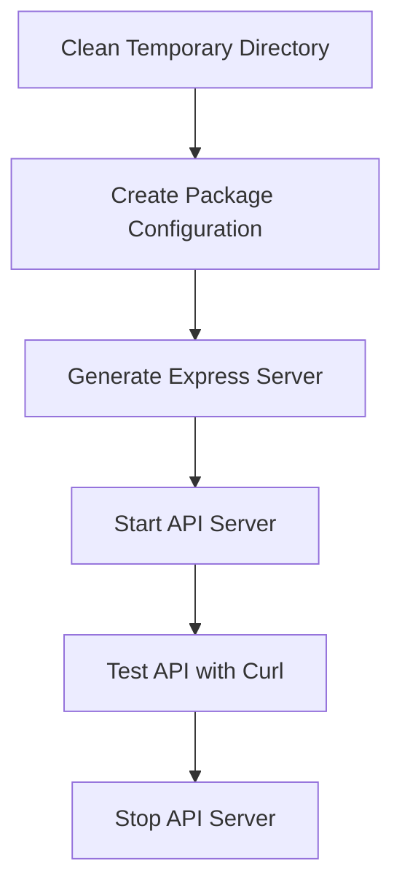

# Simple Node.js Addition API

Build and test a simple Node.js API with one endpoint that adds two numbers

## Plan Information

- **Plan ID**: simple-api-plan
- **Version**: 1.0.0
- **Created**: 2025-07-30T00:00:00.000Z
- **Created By**: Legion Framework
- **Complexity**: simple
- **Profile**: nodejs-api

## Required Modules

- `file`
- `js-generator`
- `package-manager`
- `command-executor`

## Execution Steps

### Clean Temporary Directory

  Remove old files from tmp directory

  **Type**: cleanup | **Status**: pending | **Estimated Duration**: 1000ms

  **Outputs**: tmp_cleaned

  **Actions:**
  - **command_executor**: Remove old API directory and create fresh one
    - **Inputs**: command
    - **Outputs**: cleanup_result
    - **Parameters**: command, timeout

### Create Package Configuration

  Generate package.json with Express dependencies

  **Type**: configuration | **Status**: pending | **Estimated Duration**: 2000ms | **Dependencies**: cleanup-tmp

  **Outputs**: package_created

  **Actions:**
  - **create_package_json**: Create package.json with Express
    - **Inputs**: name, dependencies
    - **Outputs**: package_file
    - **Parameters**: name, version, description, projectPath, main, scripts, dependencies, devDependencies

### Generate Express Server

  Create server.js with addition endpoint

  **Type**: code-generation | **Status**: pending | **Estimated Duration**: 3000ms | **Dependencies**: create-package

  **Outputs**: server_created

  **Actions:**
  - **generate_javascript_module**: Generate Express server with /add endpoint
    - **Inputs**: functions, writeToFile
    - **Outputs**: server_code
    - **Parameters**: name, projectPath, writeToFile, outputPath, functions, includeMain, mainFunction

### Start API Server

  Launch the Node.js server in background

  **Type**: execution | **Status**: pending | **Estimated Duration**: 3000ms | **Dependencies**: generate-server

  **Outputs**: server_running

  **Actions:**
  - **command_executor**: Start server in background
    - **Inputs**: command
    - **Outputs**: server_process
    - **Parameters**: command, timeout
  - **command_executor**: Wait for server to start
    - **Inputs**: command
    - **Outputs**: startup_wait
    - **Parameters**: command, timeout

### Test API with Curl

  Test the addition endpoint with curl requests

  **Type**: testing | **Status**: pending | **Estimated Duration**: 5000ms | **Dependencies**: start-server

  **Outputs**: api_tested

  **Actions:**
  - **command_executor**: Test health check endpoint
    - **Inputs**: command
    - **Outputs**: health_result
    - **Parameters**: command, timeout
  - **command_executor**: Test basic addition: 5 + 3 = 8
    - **Inputs**: command
    - **Outputs**: addition_result
    - **Parameters**: command, timeout
  - **command_executor**: Test with negative number: -2 + 7 = 5
    - **Inputs**: command
    - **Outputs**: negative_result
    - **Parameters**: command, timeout
  - **command_executor**: Test error handling with invalid input
    - **Inputs**: command
    - **Outputs**: error_result
    - **Parameters**: command, timeout

### Stop API Server

  Gracefully stop the Node.js server

  **Type**: cleanup | **Status**: pending | **Estimated Duration**: 2000ms | **Dependencies**: test-api

  **Outputs**: server_stopped

  **Actions:**
  - **command_executor**: Kill server process
    - **Inputs**: command
    - **Outputs**: kill_result
    - **Parameters**: command, timeout
  - **command_executor**: Verify server is stopped
    - **Inputs**: command
    - **Outputs**: verify_result
    - **Parameters**: command, timeout

## Dependencies

## Complexity Analysis

| Metric | Value |
|--------|-------|
| Total Steps | 6 |
| Total Actions | 11 |
| Dependencies | 5 |
| Max Depth | 1 |
| Complexity Score | 22 |

## Success Criteria

1. **Temporary directory cleaned successfully**
   - Condition: `${steps.cleanup-tmp.success}`
2. **Package.json created with Express dependency**
   - Condition: `${steps.create-package.success}`
3. **Server code generated successfully**
   - Condition: `${steps.generate-server.success}`
4. **Server started and accessible**
   - Condition: `${steps.start-server.success}`
5. **All API endpoints tested successfully**
   - Condition: `${steps.test-api.success}`
6. **Server stopped cleanly**
   - Condition: `${steps.stop-server.success}`
