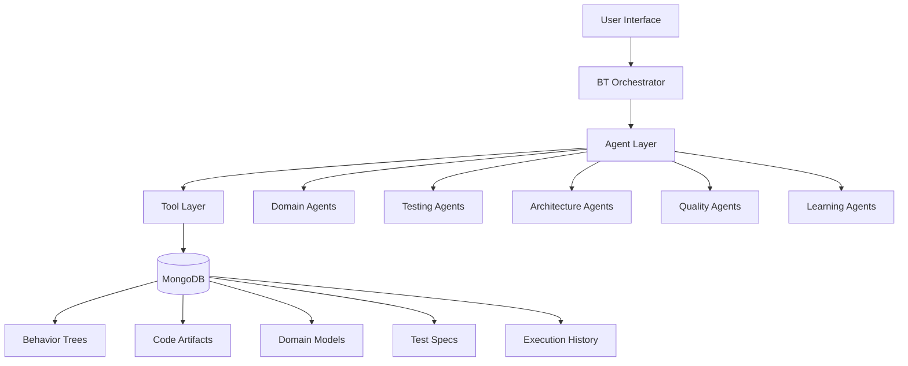

# BT-Driven Software Development Framework
## Complete Design Document

Version: 1.0.0  
Date: 2024  
Status: Draft

---

## Table of Contents

1. [Executive Summary](#executive-summary)
2. [Architecture Overview](#architecture-overview)
3. [Core Concepts](#core-concepts)
4. [Agent System](#agent-system)
5. [Workflow Orchestration](#workflow-orchestration)
6. [Data Persistence Layer](#data-persistence-layer)
7. [Implementation Roadmap](#implementation-roadmap)
8. [Quality Assurance](#quality-assurance)
9. [Integration Strategy](#integration-strategy)
10. [Future Enhancements](#future-enhancements)

---

## Executive Summary

### Vision
Transform software development from an artisanal craft into a systematic, repeatable, and continuously improving engineering discipline through Behavior Tree (BT) orchestration of development methodologies.

### Mission
Create a comprehensive framework that combines Domain-Driven Design (DDD), Test-Driven Development (TDD), Clean Architecture, and Clean Code principles into executable, introspectable, and evolvable Behavior Trees.

### Key Innovations

1. **Methodology Enforcement**: Best practices are structurally enforced, not merely suggested
2. **Living Documentation**: BT structures serve as executable documentation
3. **Continuous Learning**: System improves across projects through pattern mining
4. **Full Introspection**: Complete visibility into all development decisions and artifacts
5. **Reproducible Quality**: Consistent high-quality output across all projects

### Expected Outcomes

- **50% reduction** in defect rates through enforced TDD
- **75% improvement** in architectural consistency via Clean Architecture enforcement
- **90% automation** of routine development tasks
- **100% traceability** from requirements to implementation
- **Continuous improvement** through cross-project learning

---

## Architecture Overview

### System Architecture

```
┌─────────────────────────────────────────────────────────────┐
│                    User Interface Layer                      │
│  (CLI, Web UI, IDE Integrations, API)                       │
└─────────────────────────────────────────────────────────────┘
                              │
┌─────────────────────────────────────────────────────────────┐
│                 BT Orchestration Engine                      │
│  ┌──────────┐ ┌──────────┐ ┌──────────┐ ┌──────────┐      │
│  │Executor  │ │Scheduler │ │Validator │ │Monitor   │      │
│  └──────────┘ └──────────┘ └──────────┘ └──────────┘      │
└─────────────────────────────────────────────────────────────┘
                              │
┌─────────────────────────────────────────────────────────────┐
│                      Agent Layer                             │
│  ┌──────────────────────────────────────────────────┐      │
│  │ Domain Agents │ Testing Agents │ Architecture    │      │
│  │ Quality Agents│ Analysis Agents│ Learning Agents │      │
│  └──────────────────────────────────────────────────┘      │
└─────────────────────────────────────────────────────────────┘
                              │
┌─────────────────────────────────────────────────────────────┐
│                   Tool & Service Layer                       │
│  ┌──────────┐ ┌──────────┐ ┌──────────┐ ┌──────────┐      │
│  │Code Gen  │ │Testing   │ │Analysis  │ │Build     │      │
│  │Tools     │ │Frameworks│ │Tools     │ │Tools     │      │
│  └──────────┘ └──────────┘ └──────────┘ └──────────┘      │
└─────────────────────────────────────────────────────────────┘
                              │
┌─────────────────────────────────────────────────────────────┐
│                 Data Persistence Layer                       │
│  ┌──────────────────────────────────────────────────┐      │
│  │         MongoDB Knowledge Base                     │      │
│  │  • Behavior Trees    • Code Artifacts             │      │
│  │  • Domain Models     • Test Specifications        │      │
│  │  • Execution History • Architecture Decisions     │      │
│  └──────────────────────────────────────────────────┘      │
└─────────────────────────────────────────────────────────────┘
```

### Component Relationships



### Data Flow

1. **Input Phase**: Requirements → Domain Modeling → Test Specifications
2. **Development Phase**: TDD Cycles → Code Generation → Architecture Validation
3. **Quality Phase**: Code Analysis → Refactoring → Testing
4. **Persistence Phase**: Artifact Storage → Pattern Mining → Learning
5. **Feedback Phase**: Metrics Collection → Process Improvement → BT Evolution

---

## Core Concepts

### Behavior Tree-Driven Development (BTDD)

**Definition**: A development paradigm where the entire software development lifecycle is orchestrated through composable, introspectable, and evolvable Behavior Trees.

**Key Principles**:

1. **Declarative Process Definition**: Development processes are defined as data structures, not imperative code
2. **Composability**: Complex workflows are built from simple, reusable components
3. **Introspection**: Full visibility into process execution and decision-making
4. **Evolution**: Processes improve through learning and adaptation
5. **Enforcement**: Methodologies are structurally enforced, not optional

### Agent-Based Architecture

**Specialized Agents**: Each agent is an expert in a specific domain of software development:

- **Single Responsibility**: Each agent has one clear purpose
- **Autonomous Operation**: Agents can make decisions within their domain
- **Collaborative Execution**: Agents work together through BT orchestration
- **Continuous Learning**: Agents improve based on execution history

### Knowledge Persistence

**MongoDB as Project Memory**:

- **Complete History**: Every decision, artifact, and execution is recorded
- **Pattern Recognition**: Successful patterns are identified and reused
- **Cross-Project Learning**: Lessons from one project benefit all others
- **Evolutionary Improvement**: The system gets smarter over time

### Methodology Integration

**Unified Framework**:

```
DDD + TDD + Clean Architecture + Clean Code = Executable BTs
```

Each methodology is not just followed but structurally enforced through BT execution paths.

---

## Agent System

### Agent Categories

#### 1. Domain Modeling Agents (DDD)

**Purpose**: Transform business requirements into well-structured domain models following DDD principles.

**Key Agents**:

- **UbiquitousLanguageAgent**: Maintains consistent terminology
- **BoundedContextAgent**: Defines context boundaries
- **EntityModelingAgent**: Creates entities with identity
- **ValueObjectAgent**: Designs immutable value objects
- **AggregateDesignAgent**: Establishes aggregate boundaries
- **DomainEventAgent**: Models domain events
- **DomainServiceAgent**: Identifies domain services

#### 2. Testing Agents (TDD)

**Purpose**: Implement rigorous test-driven development cycles.

**Key Agents**:

- **TestSpecificationAgent**: Converts requirements to test specs
- **TestGeneratorAgent**: Creates failing tests (Red phase)
- **MinimalImplementationAgent**: Writes minimal passing code (Green phase)
- **TestRefactoringAgent**: Improves code while maintaining green
- **TestCoverageAgent**: Ensures comprehensive coverage
- **PropertyTestAgent**: Generates property-based tests
- **IntegrationTestAgent**: Creates integration test suites

#### 3. Architecture Agents (Clean Architecture)

**Purpose**: Enforce clean architecture principles and patterns.

**Key Agents**:

- **LayerGeneratorAgent**: Creates architectural layers
- **DependencyValidatorAgent**: Enforces dependency rules
- **PortAdapterAgent**: Implements hexagonal architecture
- **UseCaseAgent**: Generates use case interactors
- **RepositoryPatternAgent**: Creates data access abstractions

#### 4. Quality Agents (Clean Code)

**Purpose**: Maintain high code quality standards.

**Key Agents**:

- **CodeSmellDetectorAgent**: Identifies problematic patterns
- **RefactoringAgent**: Applies refactoring techniques
- **NamingConventionAgent**: Enforces naming standards
- **ComplexityAnalyzerAgent**: Measures and reduces complexity
- **DocumentationAgent**: Ensures self-documenting code

#### 5. Analysis & Learning Agents

**Purpose**: Analyze patterns and enable continuous improvement.

**Key Agents**:

- **PatternMiningAgent**: Discovers successful patterns
- **EvolutionTrackerAgent**: Tracks code evolution
- **CrossProjectLearningAgent**: Transfers knowledge between projects
- **MetricsCollectorAgent**: Gathers quality metrics
- **ImpactAnalyzerAgent**: Assesses change impacts

### Agent Communication Protocol

```json
{
  "agentId": "entity-modeling-agent",
  "messageType": "request",
  "payload": {
    "action": "createEntity",
    "context": {
      "boundedContext": "user-management",
      "entityName": "User",
      "attributes": ["id", "email", "profile"],
      "invariants": ["email must be unique"]
    }
  },
  "metadata": {
    "btExecutionId": "exec-123",
    "timestamp": "2024-01-01T12:00:00Z",
    "priority": "high"
  }
}
```

---

## Workflow Orchestration

### Core Workflow Patterns

#### 1. Complete Development Cycle

```json
{
  "type": "sequence",
  "id": "complete-development-cycle",
  "children": [
    { "ref": "domain-discovery-workflow" },
    { "ref": "tdd-implementation-workflow" },
    { "ref": "architecture-validation-workflow" },
    { "ref": "quality-assurance-workflow" },
    { "ref": "deployment-preparation-workflow" }
  ]
}
```

#### 2. TDD Red-Green-Refactor

```json
{
  "type": "retry",
  "maxAttempts": 10,
  "child": {
    "type": "sequence",
    "children": [
      {
        "type": "action",
        "agent": "TestGeneratorAgent",
        "expectedResult": "FAILURE"
      },
      {
        "type": "action",
        "agent": "MinimalImplementationAgent",
        "expectedResult": "SUCCESS"
      },
      {
        "type": "selector",
        "children": [
          {
            "condition": "hasCodeSmells",
            "agent": "RefactoringAgent"
          },
          {
            "type": "skip"
          }
        ]
      }
    ]
  }
}
```

#### 3. Domain Modeling Workflow

```json
{
  "type": "parallel",
  "id": "domain-modeling",
  "children": [
    { "agent": "UbiquitousLanguageAgent" },
    { "agent": "BoundedContextAgent" },
    {
      "type": "sequence",
      "children": [
        { "agent": "EntityModelingAgent" },
        { "agent": "ValueObjectAgent" },
        { "agent": "AggregateDesignAgent" }
      ]
    },
    { "agent": "DomainEventAgent" }
  ]
}
```

### Workflow Composition Rules

1. **Sequential Execution**: Steps that depend on previous results
2. **Parallel Execution**: Independent tasks that can run simultaneously
3. **Selective Execution**: Choose path based on conditions
4. **Retry Logic**: Handle failures with configurable retry strategies
5. **Nested Workflows**: Compose complex workflows from simpler ones

---

## Data Persistence Layer

### MongoDB Schema Design

#### Collections Overview

```javascript
// 1. behavior_trees Collection
{
  _id: ObjectId,
  projectId: String,
  btId: String,
  version: String,
  type: Enum["workflow", "agent", "tool"],
  structure: Object,  // Complete BT JSON
  metadata: {
    created: Date,
    lastModified: Date,
    author: String,
    tags: [String],
    dependencies: [String],
    successRate: Number,
    averageExecutionTime: Number
  },
  executionHistory: [{
    executionId: String,
    timestamp: Date,
    status: String,
    duration: Number,
    results: Object,
    metrics: Object
  }],
  learnings: [{
    pattern: String,
    frequency: Number,
    successRate: Number,
    context: Object
  }]
}

// 2. domain_models Collection
{
  _id: ObjectId,
  projectId: String,
  boundedContext: String,
  modelType: Enum["entity", "valueObject", "aggregate", "service"],
  name: String,
  version: String,
  schema: Object,
  invariants: [String],
  events: [String],
  commands: [String],
  queries: [String],
  relationships: [{
    type: String,
    target: String,
    cardinality: String
  }],
  validationRules: [Object],
  businessRules: [String]
}

// 3. code_artifacts Collection
{
  _id: ObjectId,
  projectId: String,
  artifactId: String,
  type: Enum["class", "interface", "function", "module"],
  layer: Enum["domain", "application", "infrastructure", "presentation"],
  path: String,
  version: String,
  content: String,
  ast: Object,  // Abstract Syntax Tree
  metrics: {
    lines: Number,
    complexity: Number,
    cohesion: Number,
    coupling: Number,
    testCoverage: Number,
    mutationScore: Number
  },
  dependencies: [String],
  dependents: [String],
  generatedBy: {
    btId: String,
    agentId: String,
    executionId: String,
    timestamp: Date
  },
  tests: [{
    testId: String,
    type: String,
    coverage: Number
  }],
  issues: [{
    type: String,
    severity: String,
    description: String,
    line: Number
  }]
}

// 4. test_specifications Collection
{
  _id: ObjectId,
  projectId: String,
  testId: String,
  type: Enum["unit", "integration", "acceptance", "property"],
  specification: {
    given: String,
    when: String,
    then: String,
    examples: [Object]
  },
  implementation: String,
  targetArtifact: String,
  coverage: {
    lines: Number,
    branches: Number,
    functions: Number,
    statements: Number
  },
  status: Enum["passing", "failing", "pending", "skipped"],
  lastRun: Date,
  executionTime: Number,
  history: [{
    date: Date,
    status: String,
    duration: Number,
    failureReason: String
  }],
  mutations: [{
    operator: String,
    killed: Boolean,
    survived: Boolean
  }]
}

// 5. architecture_decisions Collection
{
  _id: ObjectId,
  projectId: String,
  adrNumber: Number,
  title: String,
  status: Enum["proposed", "accepted", "deprecated", "superseded"],
  date: Date,
  context: String,
  decision: String,
  consequences: [String],
  alternatives: [{
    option: String,
    pros: [String],
    cons: [String]
  }],
  relatedBTs: [String],
  relatedCode: [String],
  validationRules: [Object],
  violations: [{
    date: Date,
    artifact: String,
    violation: String,
    severity: String
  }]
}

// 6. execution_logs Collection
{
  _id: ObjectId,
  executionId: String,
  projectId: String,
  btId: String,
  startTime: Date,
  endTime: Date,
  duration: Number,
  status: String,
  steps: [{
    stepId: String,
    agentId: String,
    action: String,
    startTime: Date,
    endTime: Date,
    status: String,
    input: Object,
    output: Object,
    errors: [String],
    metrics: Object
  }],
  resources: {
    cpuUsage: Number,
    memoryUsage: Number,
    diskIO: Number,
    networkIO: Number
  },
  artifacts: [String],
  learnings: [Object]
}

// 7. project_knowledge Collection
{
  _id: ObjectId,
  projectId: String,
  knowledgeType: String,
  category: String,
  content: Object,
  source: {
    btId: String,
    executionId: String,
    timestamp: Date
  },
  confidence: Number,
  usage: [{
    usedBy: String,
    timestamp: Date,
    outcome: String
  }],
  evolution: [{
    version: Number,
    change: String,
    reason: String,
    timestamp: Date
  }]
}
```

### Indexing Strategy

```javascript
// Performance-critical indexes
db.behavior_trees.createIndex({ "projectId": 1, "btId": 1 }, { unique: true })
db.behavior_trees.createIndex({ "metadata.tags": 1 })
db.behavior_trees.createIndex({ "metadata.successRate": -1 })

db.code_artifacts.createIndex({ "projectId": 1, "path": 1, "version": 1 })
db.code_artifacts.createIndex({ "layer": 1, "type": 1 })
db.code_artifacts.createIndex({ "metrics.testCoverage": -1 })
db.code_artifacts.createIndex({ "dependencies": 1 })

db.test_specifications.createIndex({ "projectId": 1, "status": 1 })
db.test_specifications.createIndex({ "targetArtifact": 1 })

db.execution_logs.createIndex({ "executionId": 1 }, { unique: true })
db.execution_logs.createIndex({ "projectId": 1, "startTime": -1 })
```

### Query Patterns

#### Find Successful Patterns
```javascript
db.behavior_trees.aggregate([
  { $match: { 
    "metadata.successRate": { $gte: 0.95 },
    "metadata.tags": { $in: ["authentication", "user-management"] }
  }},
  { $sort: { "metadata.successRate": -1 } },
  { $limit: 10 },
  { $project: {
    pattern: "$structure",
    successRate: "$metadata.successRate",
    usage: { $size: "$executionHistory" }
  }}
])
```

#### Track Code Evolution
```javascript
db.code_artifacts.aggregate([
  { $match: { path: "src/domain/User.js" } },
  { $sort: { version: 1 } },
  { $group: {
    _id: "$path",
    versions: { $push: "$$ROOT" },
    complexityTrend: { $push: "$metrics.complexity" },
    coverageTrend: { $push: "$metrics.testCoverage" }
  }}
])
```

#### Impact Analysis
```javascript
db.code_artifacts.aggregate([
  { $match: { artifactId: "UserEntity" } },
  { $graphLookup: {
    from: "code_artifacts",
    startWith: "$artifactId",
    connectFromField: "artifactId",
    connectToField: "dependencies",
    as: "impactedArtifacts",
    maxDepth: 5
  }},
  { $project: {
    artifact: "$artifactId",
    directDependents: { $size: "$dependents" },
    totalImpact: { $size: "$impactedArtifacts" },
    criticalPaths: "$impactedArtifacts"
  }}
])
```

---

## Implementation Roadmap

### Phase 1: Foundation (Weeks 1-4)

**Objectives**:
- Set up project structure
- Implement core BT execution engine
- Create MongoDB integration layer
- Build basic agent framework

**Deliverables**:
- [ ] Directory structure and build configuration
- [ ] BT executor with introspection capabilities
- [ ] MongoDB connection and schema implementation
- [ ] Base Agent class with communication protocol
- [ ] Initial test suite

### Phase 2: Domain Modeling (Weeks 5-8)

**Objectives**:
- Implement DDD agents
- Create domain modeling workflows
- Build ubiquitous language management
- Develop bounded context mapping

**Deliverables**:
- [ ] All 7 domain modeling agents
- [ ] Domain discovery workflow
- [ ] MongoDB persistence for domain models
- [ ] Domain model validation tools
- [ ] Event storming facilitation

### Phase 3: Testing Framework (Weeks 9-12)

**Objectives**:
- Implement TDD agents
- Create test generation capabilities
- Build test execution infrastructure
- Develop coverage analysis

**Deliverables**:
- [ ] All 7 testing agents
- [ ] Red-Green-Refactor workflow
- [ ] Test generation from specifications
- [ ] Coverage and mutation testing
- [ ] Test result persistence

### Phase 4: Architecture Enforcement (Weeks 13-16)

**Objectives**:
- Implement Clean Architecture agents
- Create layer generation tools
- Build dependency validation
- Develop architectural metrics

**Deliverables**:
- [ ] All 5 architecture agents
- [ ] Layer generation workflows
- [ ] Dependency rule enforcement
- [ ] Architecture decision records
- [ ] Violation detection and reporting

### Phase 5: Quality Assurance (Weeks 17-20)

**Objectives**:
- Implement Clean Code agents
- Create refactoring workflows
- Build code analysis tools
- Develop quality metrics

**Deliverables**:
- [ ] All 5 quality agents
- [ ] Automated refactoring workflows
- [ ] Code smell detection
- [ ] Complexity analysis
- [ ] Quality gate enforcement

### Phase 6: Learning System (Weeks 21-24)

**Objectives**:
- Implement learning agents
- Create pattern mining capabilities
- Build cross-project knowledge transfer
- Develop process evolution

**Deliverables**:
- [ ] All 5 learning agents
- [ ] Pattern recognition algorithms
- [ ] Knowledge graph construction
- [ ] Process improvement workflows
- [ ] Success prediction models

### Phase 7: Integration & UI (Weeks 25-28)

**Objectives**:
- Build user interfaces
- Create IDE integrations
- Develop CI/CD pipelines
- Implement monitoring

**Deliverables**:
- [ ] Web-based UI
- [ ] CLI tools
- [ ] VS Code extension
- [ ] GitHub Actions integration
- [ ] Monitoring dashboard

---

## Quality Assurance

### Testing Strategy

#### Unit Testing
- Each agent tested in isolation
- Mock dependencies and MongoDB
- 90% code coverage requirement
- Property-based testing for generators

#### Integration Testing
- Agent communication protocols
- BT workflow execution
- MongoDB operations
- Tool integrations

#### End-to-End Testing
- Complete development cycles
- Real project scenarios
- Performance benchmarks
- Failure recovery

### Quality Metrics

#### Code Quality
- **Complexity**: Cyclomatic complexity < 10
- **Coverage**: Test coverage > 90%
- **Duplication**: < 3% duplicate code
- **Dependencies**: No circular dependencies
- **Standards**: 100% linting compliance

#### Process Quality
- **Success Rate**: > 95% workflow completion
- **Performance**: < 5s average agent execution
- **Reliability**: < 0.1% failure rate
- **Scalability**: Support 100+ concurrent executions
- **Learning**: Measurable improvement over time

### Quality Gates

```json
{
  "type": "sequence",
  "id": "quality-gates",
  "children": [
    {
      "gate": "test-coverage",
      "threshold": 90,
      "action": "block"
    },
    {
      "gate": "complexity",
      "threshold": 10,
      "action": "warn"
    },
    {
      "gate": "architecture-violations",
      "threshold": 0,
      "action": "block"
    },
    {
      "gate": "performance",
      "threshold": "5s",
      "action": "warn"
    }
  ]
}
```

---

## Integration Strategy

### External Tool Integration

#### Code Generation Tools
- **Template Engines**: Handlebars, Mustache
- **AST Manipulation**: Babel, Recast
- **Formatters**: Prettier, ESLint
- **Type Systems**: TypeScript, Flow

#### Testing Frameworks
- **Unit Testing**: Jest, Mocha
- **Integration Testing**: Supertest
- **E2E Testing**: Cypress, Playwright
- **Property Testing**: fast-check
- **Mutation Testing**: Stryker

#### Analysis Tools
- **Static Analysis**: SonarQube, CodeClimate
- **Dependency Analysis**: Madge, Dependency Cruiser
- **Performance**: Lighthouse, WebPageTest
- **Security**: Snyk, OWASP

### IDE Integration

#### VS Code Extension
```typescript
interface BTDevExtension {
  // Workflow execution
  executeWorkflow(workflowId: string): Promise<Result>
  
  // Agent interaction
  invokeAgent(agentId: string, params: any): Promise<any>
  
  // Real-time feedback
  onCodeChange(callback: (change: Change) => void): void
  
  // Visualization
  visualizeBT(btId: string): void
  showExecutionHistory(projectId: string): void
}
```

### CI/CD Integration

#### GitHub Actions Workflow
```yaml
name: BT-Driven Development
on: [push, pull_request]

jobs:
  bt-development:
    runs-on: ubuntu-latest
    steps:
      - uses: actions/checkout@v2
      - name: Setup BT Framework
        run: npm install -g @bt/cli
      - name: Execute Development Workflow
        run: bt execute complete-development-cycle
      - name: Validate Quality Gates
        run: bt validate quality-gates
      - name: Store Artifacts
        run: bt persist --to mongodb
```

---

## Future Enhancements

### AI/ML Integration

#### Predictive Modeling
- Success probability estimation
- Optimal workflow selection
- Resource requirement prediction
- Defect likelihood analysis

#### Natural Language Processing
- Requirements extraction
- Test case generation from user stories
- Documentation generation
- Code explanation

#### Computer Vision
- UI/UX testing
- Visual regression detection
- Screenshot-based testing
- Design system compliance

### Advanced Capabilities

#### Distributed Execution
```javascript
class DistributedBTExecutor {
  async distributeWorkflow(workflow, nodes) {
    const tasks = this.partitionWorkflow(workflow);
    const results = await Promise.all(
      tasks.map(task => this.executeOnNode(task, this.selectNode(nodes)))
    );
    return this.mergeResults(results);
  }
}
```

#### Multi-Project Orchestration
```javascript
class ProjectOrchestrator {
  async orchestrateProjects(projects) {
    // Identify shared components
    const shared = this.findSharedComponents(projects);
    
    // Optimize execution order
    const order = this.topologicalSort(projects);
    
    // Execute with dependency awareness
    for (const project of order) {
      await this.executeProject(project, shared);
    }
  }
}
```

#### Real-Time Collaboration
```javascript
class CollaborativeBT {
  constructor() {
    this.websocket = new WebSocket('ws://bt-server');
    this.sharedState = new SharedState();
  }
  
  async collaborativeEdit(btId, changes) {
    await this.lock(btId);
    await this.applyChanges(changes);
    await this.broadcast(changes);
    await this.unlock(btId);
  }
}
```

### Ecosystem Development

#### Plugin Architecture
```javascript
interface BTPlugin {
  name: string;
  version: string;
  
  // Lifecycle hooks
  onInstall(): void;
  onActivate(): void;
  onDeactivate(): void;
  
  // Extension points
  agents?: Agent[];
  workflows?: Workflow[];
  tools?: Tool[];
  validators?: Validator[];
}
```

#### Marketplace
- Community-contributed agents
- Industry-specific workflows
- Domain templates
- Best practice patterns

#### Education Platform
- Interactive tutorials
- Certification programs
- Best practice guides
- Case studies

---

## Appendices

### A. Glossary

- **Agent**: Specialized autonomous component handling specific development tasks
- **BT (Behavior Tree)**: Hierarchical decision structure for orchestrating workflows
- **Workflow**: Sequence of coordinated agent actions
- **Artifact**: Any generated or modified code/document
- **Quality Gate**: Checkpoint ensuring standards compliance

### B. References

1. Evans, E. (2003). Domain-Driven Design: Tackling Complexity in the Heart of Software
2. Martin, R. C. (2017). Clean Architecture: A Craftsman's Guide
3. Beck, K. (2002). Test Driven Development: By Example
4. Fowler, M. (2018). Refactoring: Improving the Design of Existing Code

### C. Configuration Examples

#### Project Configuration
```json
{
  "project": {
    "id": "my-app",
    "name": "My Application",
    "type": "web-application",
    "methodologies": ["DDD", "TDD", "Clean Architecture"],
    "qualityGates": {
      "coverage": 90,
      "complexity": 10,
      "duplication": 3
    },
    "mongodb": {
      "uri": "mongodb://localhost:27017",
      "database": "my-app-dev"
    }
  }
}
```

#### Workflow Configuration
```json
{
  "workflow": {
    "id": "feature-development",
    "name": "Feature Development Workflow",
    "triggers": ["branch-created", "issue-assigned"],
    "steps": [
      { "agent": "RequirementsAnalyzer" },
      { "agent": "DomainModeler" },
      { "workflow": "tdd-cycle" },
      { "agent": "ArchitectureValidator" },
      { "agent": "QualityEnforcer" }
    ],
    "onSuccess": "merge-to-main",
    "onFailure": "notify-developer"
  }
}
```

---

## Conclusion

This BT-Driven Software Development Framework represents a paradigm shift in how we approach software engineering. By combining proven methodologies with modern automation and learning capabilities, we create a system that not only produces high-quality software but continuously improves its ability to do so.

The framework transforms software development from an art into a science - reproducible, measurable, and continuously evolving. Through the power of Behavior Trees, specialized agents, and persistent knowledge, we achieve a level of quality and consistency previously unattainable in software development.

As the system learns from each project, it becomes increasingly valuable, turning every development effort into an investment in future productivity and quality. This is not just a tool or framework - it's a new way of thinking about and practicing software development.